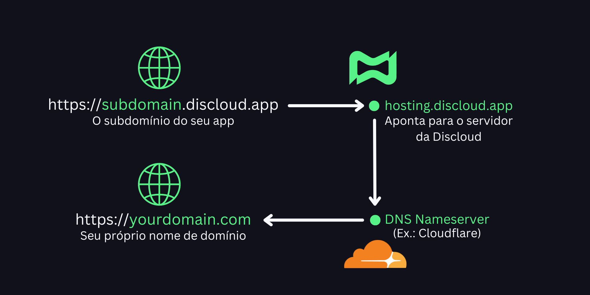
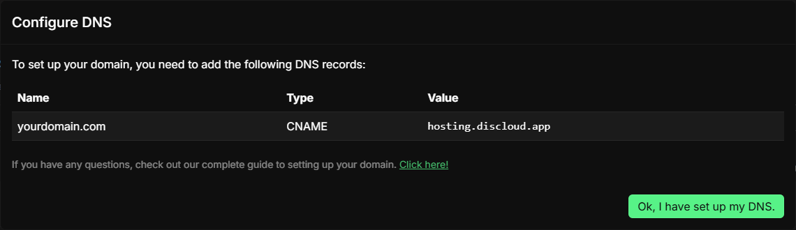
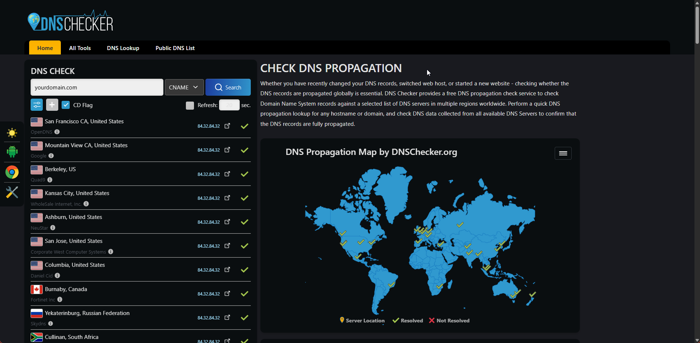

# Domínio Personalizado

## 🧭 Visão Geral

Você pode mapear seu próprio domínio (ex. `seudominio.com`) ou um subdomínio (ex. `dash.seudominio.com`) para uma aplicação hospedada na Discloud. A plataforma serve tráfego através do [subdomínio Discloud](../faq/perguntas-gerais/em-andamento-como-criar-um-subdominio.md) da sua app usando um registro CNAME e valida a propriedade via registros TXT.

<figure><figcaption></figcaption></figure>

---

## 📋 Requisitos

✔ [Plano Platinum ou superior](https://discloud.com/plans) é necessário para hospedar websites ou APIs.\
✔ [App já hospedada](../como-hospedar/websites-e-apis.md) usando um subdomínio Discloud (ex. `exemplo.discloud.app`)\
✔ Um domínio registrado que você controla (Cloudflare, GoDaddy, Namecheap, etc.)\
✔ Capacidade de adicionar / modificar registros CNAME e TXT

---

## 🏗️ Adicione Seu Domínio (Painel)



Abra o [Painel Discloud](https://discloud.com/dashboard) → seção Domínio Personalizado.



Digite seu domínio (ex. `seudominio.com`). Opcionalmente especifique um subdomínio (ex. `dash`).



Clique em **Registrar** e depois no botão **DNS**. Quando clicar, você verá os registros que precisa configurar (CNAME e, se necessário, tokens TXT).



<figure><figcaption></figcaption></figure> <figure><figcaption></figcaption></figure>

---

## ✅ Verificar e Configurar DNS

Embora qualquer provedor DNS funcione, abaixo estão cenários com abas para clareza.



**Registros**

| Tipo                | Nome                      | Valor                  |
| ------------------- | ------------------------- | ---------------------- |
| CNAME               | `@` (ou raiz do provedor) | `hosting.discloud.app` |
| TXT _(se mostrado)_ | `@` / fornecido           | Token de verificação   |

Se seu provedor DNS não permitir CNAME raiz, use:



CNAME `www` → `hosting.discloud.app`



Redirecionar / ALIAS raiz → `www.seudominio.com`





**Exemplo: `dash.seudominio.com`**

<table><thead><tr><th width="144">Tipo</th><th width="353">Nome</th><th>Valor</th></tr></thead><tbody><tr><td>CNAME</td><td><code>dash</code></td><td><code>hosting.discloud.app</code></td></tr><tr><td>TXT <em>(se mostrado)</em></td><td>Fornecido (<code>dash</code> / <code>_discloud-verification</code>)</td><td>Token de verificação</td></tr></tbody></table>

Múltiplos subdomínios (ex. `api`, `app`) repetem este padrão independentemente.



### 📡 **Propagação DNS**

- Mudanças DNS normalmente se propagam em poucos minutos.
- No entanto, **valores TTL** e **cache do resolvedor** podem causar alguns atrasos.
- Para verificar mudanças em todo o mundo, confira [dnschecker.org](https://dnschecker.org/)
- Se alguns POPs ainda exibirem registros antigos, aguarde e verifique novamente mais tarde.

<figure><figcaption></figcaption></figure>

---

## 🔄 Reconstruir a App

Após o DNS resolver e os tokens validarem, abra a app vinculada e acione Reconstruir para que a vinculação se torne ativa.

<figure><figcaption></figcaption></figure> <figure><figcaption></figcaption></figure>

