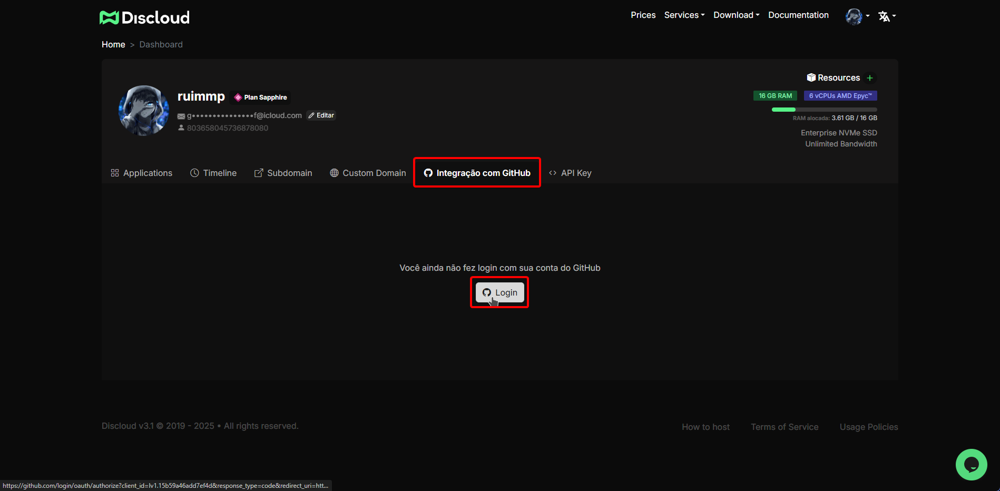
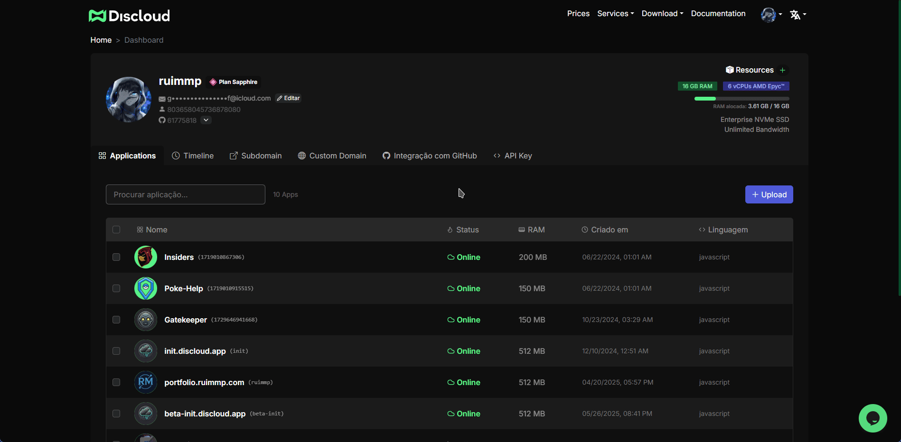

# Integração com GitHub

## ✅ **Pré-requisitos**



**Consistência da Conta GitHub**


A conta GitHub usada para **login na Discloud** E **propriedade do repositório deve ser a mesma.**


> **Consequências de incompatibilidade**:
>
> * Repositórios não aparecerão
> * Falhas de uploads
> * Erros de permissão



**Arquivo** [**`discloud.config`**](https://github.com/discloud/docs/blob/portuguese-revamp/configuracoes/discloud.config) **Válido**

Deve existir no **diretório raiz** do seu repositório.

> ⚠️ **A validação falha se**:
>
> * Arquivo ausente
> * Sintaxe inválida



***

## 🔄 **Conectar GitHub e Configurar Acesso**



Iniciar Conexão GitHub

* Vá para [Painel Discloud](https://discloud.com/dashboard) → aba **Integração GitHub**
*   Clique em **Login** → Autorize Discloud via GitHub OAuth

    <figure><figcaption></figcaption></figure>



Configurar Acesso ao Repositório

* Volte para **Integração GitHub** → Clique em **Configurar**
* Escolha o alvo da instalação.
* Defina permissões:
  * 🔓 _Todos os repositórios_
  * 🔒 _Selecionar repositórios específicos_



***

## 🚀 **Upload do GitHub**



**Iniciar Upload**

* Vá para [Painel Discloud](https://discloud.com/dashboard)
* Clique em "**+ Upload"** (canto superior direito)
* Selecione "**GitHub"** no menu



**Configuração e Upload**


#### **🔐 Variáveis de Ambiente Seguras**

Use arquivos [`.env`](../faq/perguntas-gerais/em-andamento-arquivo-.env.md) localmente para desenvolvimento, mas certifique-se de que eles sejam adicionados ao `.gitignore` para evitar exposição acidental no GitHub. Ao fazer o upload via integração GitHub da Discloud, **adicione segredos de produção diretamente na seção "Variáveis de Ambiente"** durante a configuração.




<figure><figcaption></figcaption></figure>
