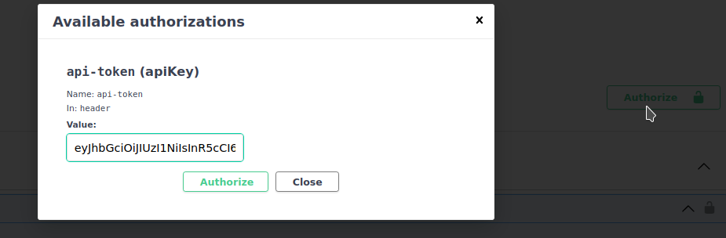
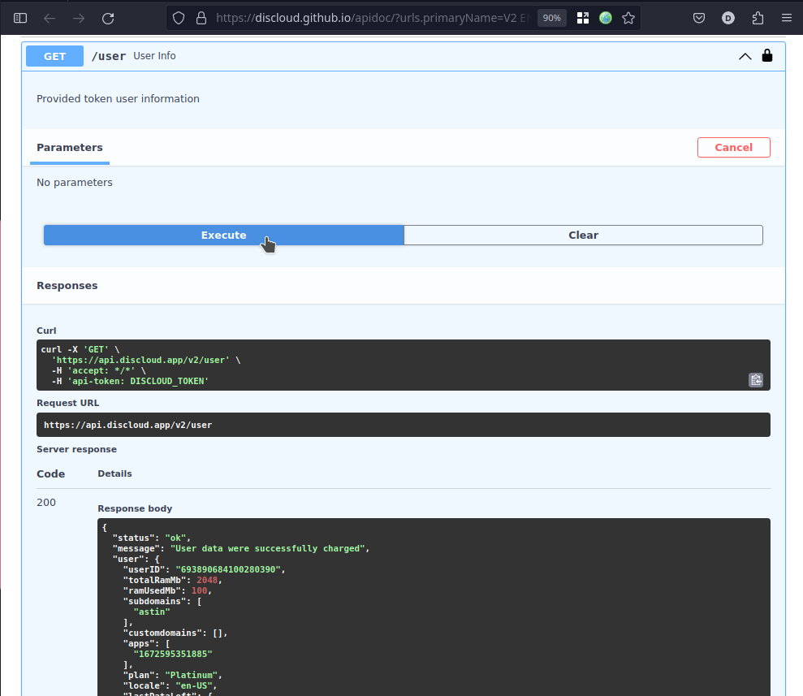

# 📡 Usar a API

## :pencil: Requisitos

#### Obter o token

Para obter o seu token use o comando [api](../suporte/comandos/api.md).

<figure><figcaption></figcaption></figure>

## Começar

[Acesse as rotas da API](https://discloud.github.io/apidoc/)\
Clique em `Authorize` e cole o seu Token da API

<figure><figcaption>
Colocando o token
</figcaption></figure>

## Comece a usar a API

exemplo com a rota `/user`

<figure><figcaption>
Exemplo da responta da rota /user
</figcaption></figure>

Você pode importar o código `curl` em aplicativos como o [Insomnia](https://insomnia.rest/download) ou [Postman](https://www.postman.com/downloads/), e a partir deles gerar o código para a linguagem que desejar

> Exemplos:




<figure><figcaption>
1
</figcaption></figure>

 

<figure><figcaption>
2
</figcaption></figure>





<figure><figcaption>
1
</figcaption></figure>

 

<figure><figcaption>
2
</figcaption></figure>




Exemplo com a rota `/upload`

* O seu arquivo `.zip` deve incluir o [discloud.config](../discloud.config/configurar/)
* O seu arquivo `.zip` deve ter um tamanho `<=100MB`

<figure><figcaption></figcaption></figure>
