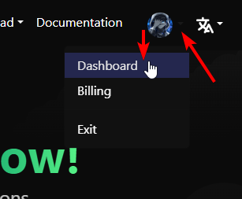
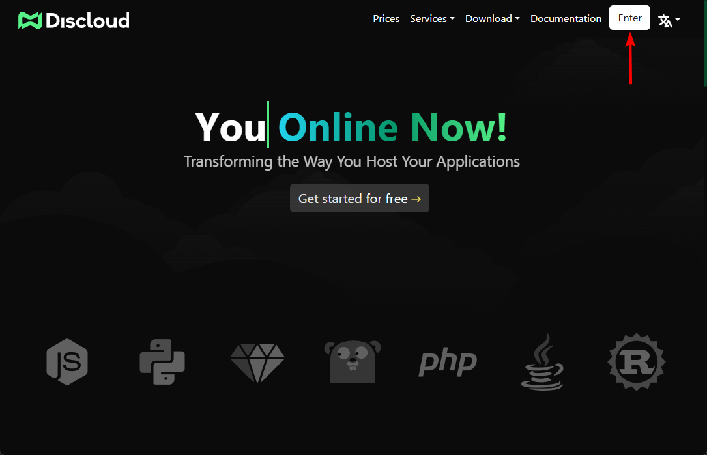

# Painel de Controle

## 📁 Preparando os Arquivos do Seu Projeto

Antes de enviar seu projeto, certifique-se de que seus arquivos estão corretamente estruturados de acordo com a linguagem de programação que você está utilizando. Diferentes linguagens possuem requisitos específicos para gerenciamento de dependências, estrutura do projeto e arquivos necessários.


[linguagens-suportadas](../ambiente-de-desenvolvimento/linguagens-suportadas/)


### 📌 Requisitos Básicos

* **Código-Fonte do Projeto** – Todos os arquivos necessários para a execução da sua aplicação.
* **Arquivo de Configuração (**[**`discloud.config`**](../configuracoes/discloud.config/)**)** – Obrigatório para as configurações de upload.
* **Arquivo de Dependências** (se aplicável):
  * [`package.json`](../ambiente-de-desenvolvimento/linguagens-suportadas/javascript/package.json.md) para [**Node.js**](../ambiente-de-desenvolvimento/ambiente-local/nodejs.md)
  * [`requirements.txt`](../ambiente-de-desenvolvimento/linguagens-suportadas/python/requirements.txt.md) para [**Python**](../ambiente-de-desenvolvimento/ambiente-local/python.md)
  * [`Cargo.toml`](../ambiente-de-desenvolvimento/linguagens-suportadas/rust/cargo.toml.md) para [**Rust**](../ambiente-de-desenvolvimento/ambiente-local/rust.md)
  * [`Gemfile`](../ambiente-de-desenvolvimento/linguagens-suportadas/ruby/gemfile.md) para [**Ruby**](../ambiente-de-desenvolvimento/ambiente-local/ruby.md)

### **🗑️** Excluindo Arquivos Desnecessários

Para **otimizar seu upload**, certifique-se de **remover arquivos desnecessários** antes de compactar seu projeto em um arquivo `.zip`.

#### ❌ Arquivos e pastas comuns a serem excluídos:

```diff
- node_modules
- venv
- .git
- .DS_Store
- __pycache__
```

> Para informações detalhadas sobre os arquivos necessários e configurações apropriadas, consulte a [documentação da linguagem](../ambiente-de-desenvolvimento/linguagens-suportadas/) que você está usando para seu projeto.

***

## 🔑 Autenticação – Como entrar no seu Painel

Antes de fazer o upload da sua aplicação, você precisa **entrar na Discloud**:



Visite a [Discloud](https://discloud.com/).



Clique em "**Entrar**" e faça login.

<details>

<summary>Acesse o Painel se você já estiver logado.</summary>



</details>

<figure><figcaption></figcaption></figure>



***

## 🚀 Hospedando a Sua Aplicação

Depois que seus arquivos estiverem prontos, siga estes passos para enviar e fazer o upload da sua aplicação.



Compactando Seu Projeto.

Antes de enviar, compacte todo o seu projeto em um arquivo [.zip](../faq/perguntas-gerais/em-andamento-como-comprimir.md).



Enviando para o Painel.



Acesse o **Painel da Discloud**.



Clique em "**Upload**" e selecione seu arquivo `.zip`.



Aguarde a conclusão do envio.




Durante o envio, evite atualizar a página para prevenir problemas com sua aplicação. Se isso ocorrer, pode ser necessário remover a aplicação e repetir o processo de envio.




Processo de Upload.

* Após o envio, a Discloud **iniciará automaticamente sua aplicação**.
* Se seu projeto estiver corretamente configurado e não exceder o **limite de RAM**, ele deverá ficar online em segundos.
* Você pode verificar seu status através do Painel.



***

## **❓** Ainda precisa de ajuda?

Consulte a [Seção de FAQ](broken-reference) ou entre no nosso [servidor Discord](https://discord.discloudbot.com/) para suporte.
