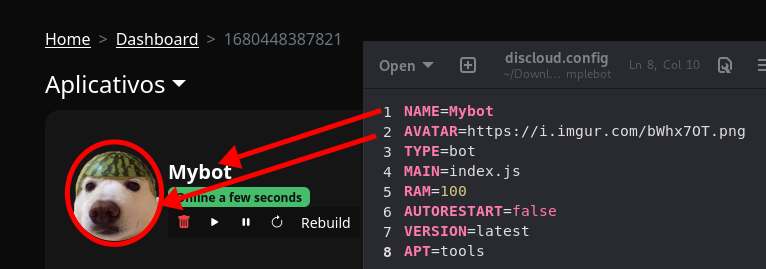

# 🛠️ discloud.config

## 📝 Introdução

O `discloud.config` é um arquivo essencial para configurar as suas aplicações na **Discloud**. Ele permite que você defina parâmetros, como o tipo de aplicação, o arquivo principal, a quantidade de RAM e outras opções importantes para o funcionamento da sua aplicação. Neste guia, você aprenderá como configurar-lo corretamente e realizar o upload da sua aplicação.

***

## 📄 Como Utilizar

Existem parâmetros obrigatórios e opcionais que você pode configurar no `discloud.config`. Veja abaixo dois exemplos práticos, um para bots e outro para sites/APIs.


O arquivo `discloud.config` deve ser colocado na raiz do seu projeto, para que seja reconhecido corretamente durante o upload. Certifique-se de que ele esteja incluído no seu arquivo `.zip` antes de fazer o upload para a Discloud. A estrutura do projeto deve conter todos os arquivos principais, como o exemplo abaixo, incluindo o arquivo de configuração e os arquivos principais da sua aplicação:

```
- meu-projeto.zip/
  - comandos/
  - eventos/
  - discloud.config
  - index.js
  - package.json
```





**Requisitos**\
\
Para hospedar bots, você deve ter, no mínimo, 100MB de RAM disponíveis.


<pre class="language-ini"><code class="lang-ini"><a data-footnote-ref href="#user-content-fn-1">NAME=Meu Bot</a>
<a data-footnote-ref href="#user-content-fn-2">AVATAR=https://i.imgur.com/bWhx7OT.png</a>
<a data-footnote-ref href="#user-content-fn-3">TYPE=bot</a>
<a data-footnote-ref href="#user-content-fn-4">MAIN=index.js</a>
<a data-footnote-ref href="#user-content-fn-5">RAM=100</a>
<a data-footnote-ref href="#user-content-fn-6">AUTORESTART=false</a>
<a data-footnote-ref href="#user-content-fn-7">VERSION=latest</a>
<a data-footnote-ref href="#user-content-fn-8">APT=tools</a>
</code></pre>




**Requisitos**\
\
Para hospedar sites ou APIs, você deve ter, no mínimo, 512MB de RAM disponíveis.


<pre class="language-ini"><code class="lang-ini"><a data-footnote-ref href="#user-content-fn-9">NAME=Meu Site</a>
<a data-footnote-ref href="#user-content-fn-10">AVATAR=https://i.imgur.com/bWhx7OT.png</a>
<a data-footnote-ref href="#user-content-fn-11">ID=subdomínio</a>
<a data-footnote-ref href="#user-content-fn-12">TYPE=site</a>
<a data-footnote-ref href="#user-content-fn-13">MAIN=index.js</a>
<a data-footnote-ref href="#user-content-fn-14">RAM=512</a>
<a data-footnote-ref href="#user-content-fn-15">AUTORESTART=false</a>
<a data-footnote-ref href="#user-content-fn-16">VERSION=latest</a>
<a data-footnote-ref href="#user-content-fn-17">APT=tools</a>
</code></pre>




Observação\
\
As opções de `NAME` e `AVATAR` permitem personalizar o nome e a imagem da sua aplicação, seja ela um bot ou um site. Esses parâmetros são exibidos na dashboard e também através de comandos do nosso bot, como `.app` ou `.status`.




[^1]: Nome da sua aplicação. <mark style="color:green;">(opcional)</mark>

[^2]: URL com uma imagem para sua aplicação. <mark style="color:green;">(opcional)</mark>

[^3]: Tipo de aplicação (bot ou site). <mark style="color:red;">(obrigatório)</mark>

[^4]: Arquivo principal da sua aplicação. <mark style="color:red;">(obrigatório)</mark>

[^5]: Quantidade de RAM em MB. <mark style="color:red;">(obrigatório)</mark>

[^6]: Reinício automático em caso de falha. <mark style="color:green;">(opcional)</mark>

[^7]: Versão da imagem de container. <mark style="color:green;">(opcional)</mark>

[^8]: Pacotes APT a serem instalados. <mark style="color:green;">(opcional)</mark>

[^9]: Nome da sua aplicação. <mark style="color:green;">(opcional)</mark>

[^10]: URL com uma imagem para sua aplicação. <mark style="color:green;">(opcional)</mark>

[^11]: Subdomínio a ser usado pela sua aplicação. <mark style="color:red;">(obrigatório)</mark>

[^12]: Tipo de aplicação (bot ou site). <mark style="color:red;">(obrigatório)</mark>

[^13]: Arquivo principal da sua aplicação. <mark style="color:red;">(obrigatório)</mark>

[^14]: Quantidade de RAM em MB. <mark style="color:red;">(obrigatório)</mark>

[^15]: Reinício automático em caso de falha. <mark style="color:green;">(opcional)</mark>

[^16]: Versão da imagem de container. <mark style="color:green;">(opcional)</mark>

[^17]: Pacotes APT a serem instalados. <mark style="color:green;">(opcional)</mark>
