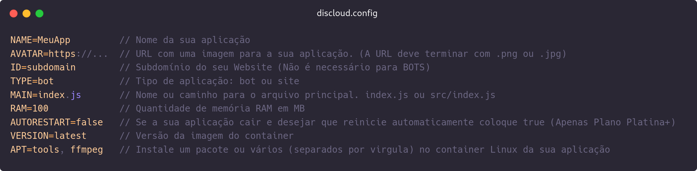
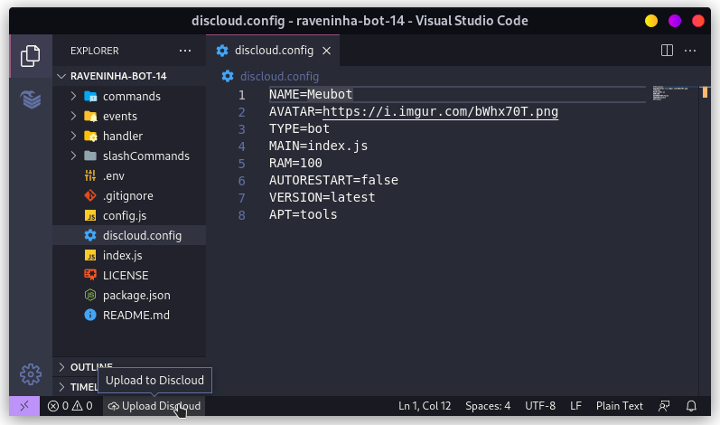

# ⚙ Configurar

O `discloud.config` é um arquivo de configurações, que agiliza o processo de upload de suas aplicações para a DisCloud.

## :gear: Como Utilizar

Detalhes para cada opção



> Consulte a lista de opções para: [VERSION](version.md), [APT](apt.md)

> Se estiver fazendo um `bot` ou um `site` pode se basear nos exemplos abaixo:




Para hospedar um bot precisa de **100MB** de RAM no mínimo



```tsconfig
NAME=Meubot
AVATAR=https://i.imgur.com/bWhx7OT.png
TYPE=bot
MAIN=index.js
RAM=100
AUTORESTART=false
VERSION=latest
APT=tools
```





Para hospedar um site precisa de **512MB** de RAM no mínimo, e um [Plano Platina](https://discloudbot.com/plans)



```tsconfig
NAME=MeuSite
AVATAR=https://i.imgur.com/bWhx7OT.png
ID=subdomain
TYPE=site
MAIN=index.js
RAM=512
AUTORESTART=false
VERSION=latest
APT=tools
```





Coloque o `discloud.config` na raiz do seu projeto e não se esqueça de incluir no seu [.zip](../../suporte/faq/zip.md)




## :cloud: Fazendo o upload pelo site

Com o seu [.zip ](../../suporte/faq/zip.md)criado com o `discloud.config` chegou a hora do Upload, para utilizar é muito simples!

<figure><figcaption><p>upload pelo site</p></figcaption></figure>
