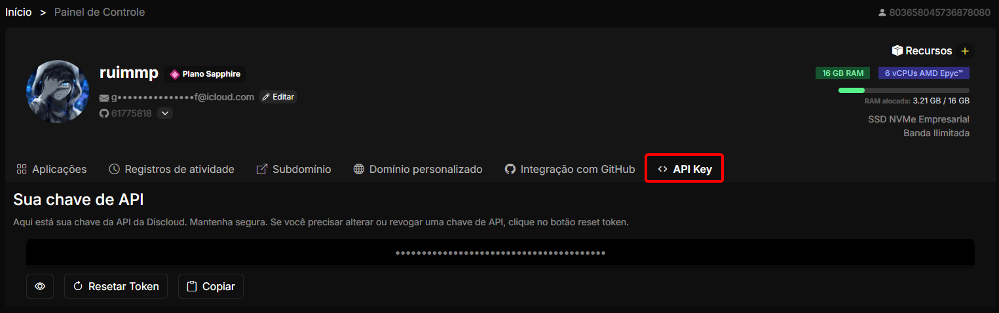

# Como obter o meu token da API da Discloud?

## 🔑 O que é o Token da API da Discloud?

Seu **Token da API da Discloud** é uma **credencial pessoal e secreta** que autentica você em todas as superfícies de desenvolvedor da Discloud:

* [**Requisições à REST API**](../../api-and-integrations/api-overview/)
* [**CLI Oficial**](../../how-to-host-using/cli.md)
* [**Extensão para VS Code**](../../how-to-host-using/visual-studio-code.md)
* **SDKs / Bibliotecas** (ex.: [npm](../../sdks-and-libraries/npm-library/), [Python](../../sdks-and-libraries/python-library/))

Ele identifica sua conta de forma única, então **qualquer pessoa com esse token pode agir como você**. Trate-o como uma senha.

***

## 📍 Onde Encontrar

Siga estes passos para visualizar (ou copiar) seu token no Dashboard:



Abra o Dashboard: [https://discloud.com/dashboard](https://discloud.com/dashboard)



Clique na aba **API Key** (na parte superior da sua área de perfil).

<figure><figcaption></figcaption></figure>



Use o botão **Copy** para copiar o token para sua área de transferência.



> Se o campo estiver oculto, clique no **ícone de olho** para revelar. Use **Resetar Token** apenas se suspeitar de comprometimento.

***

## 🔒 Boas Práticas de Segurança

| Prática                                     | Por quê                                       |
| ------------------------------------------- | --------------------------------------------- |
| Mantenha privado (não compartilhe / print)  | Evita sequestro da conta                      |
| NÃO faça commit no Git                      | Repositórios públicos são escaneados por bots |
| Use variáveis de ambiente / secret managers | Rotação centralizada e logs mais seguros      |
| Recrie (Resetar Token) se exposto           | Invalida imediatamente o token antigo         |


Se você publicar ou colar seu token em algum lugar público por engano, **reinicie-o imediatamente** no Dashboard (aba API Key) e reimplante qualquer serviço que usava o token antigo.

