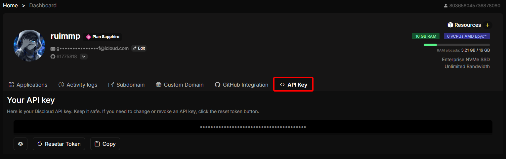

# How can I get my Discloud API token?

## 🔑 What is the Discloud API Token?

Your **Discloud API Token** is a **personal, secret credential** that authenticates you to all Discloud developer surfaces:

* [**REST API requests**](../../api-and-integrations/api-overview/)
* [**Official CLI**](../../how-to-host-using/cli.md)
* [**VS Code Extension**](../../how-to-host-using/visual-studio-code.md)
* **SDK / Libraries** (e.g. [npm](../../sdks-and-libraries/npm-library/), [Python](../../sdks-and-libraries/python-library/))

It uniquely identifies your account, so **anyone with this token can act as you**. Treat it like a password.

***

## 📍 Where to Get It

Follow these steps to view (or copy) your token on the Dashboard:



Open the Dashboard: [https://discloud.com/dashboard](https://discloud.com/dashboard)



Click the **API Key** tab (top section of your profile area).

<figure><figcaption></figcaption></figure>



Use the **Copy** button to place the token on your clipboard.



> If the field is hidden, click the **eye icon** to reveal it. Use **Reset Token** only if you suspect compromise.

***

## 🔒 Security Best Practices

| Practice                                    | Why                               |
| ------------------------------------------- | --------------------------------- |
| Keep it private (never share or screenshot) | Prevent account takeover          |
| Do NOT commit to Git                        | Public repos are scanned by bots  |
| Use environment variables / secret managers | Centralized rotation & safer logs |
| Rotate (Reset Token) if exposed             | Immediately invalidates old token |


If you accidentally publish or paste your token somewhere public, **reset it immediately** on the Dashboard (API Key tab) and redeploy any services using the old one.

