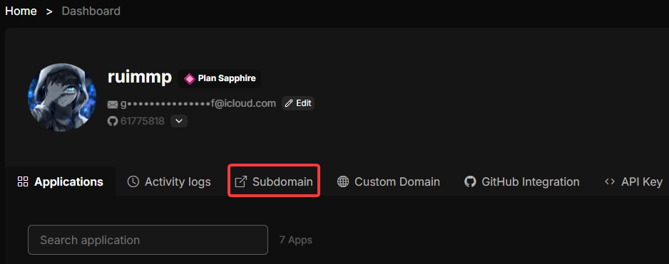
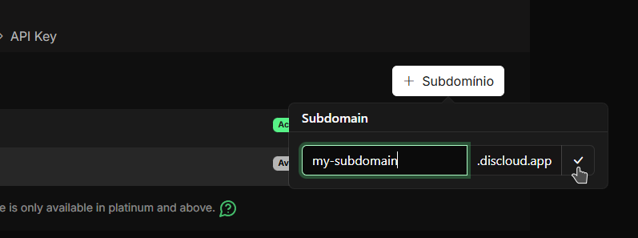

# How to Create a Subdomain?

## 🌐 What is a Discloud Subdomain?

On **Discloud**, any app that uses a **port** and requires **external access** through it to be accessed is considered a site. This includes bots with dashboards, dashboards, APIs, static and dynamic sites, and many others…

To allow external access to your app, Discloud offers the option to create a **custom subdomain**. This subdomain redirects traffic through the Discloud proxy to **port 8080** of your app, allowing you and users to access your site **securely and reliably**.

### 📡 How it Works

<figure><figcaption></figcaption></figure>

***

## ✅ Requirements

To register and use a Discloud subdomain, you must meet the following requirements:


[Platinum Plan or Higher](https://discloud.com/plans) is required to host websites or APIs.



**Port 8080** – Your application must listen on port 8080 for external traffic



**Discloud Config** – Your app must include a properly configured [`discloud.config`](../../configurations/discloud.config/) file


***

## 🚀 Register Your Subdomain



Open the [**Discloud Dashboard**](https://discloud.com/dashboard).



Click on the `Subdomain` tab at the top of the application page.

<figure><figcaption></figcaption></figure>



Click the `+ Subdomain` button to create a new subdomain.

<figure><figcaption></figcaption></figure>



Enter your desired subdomain name (e.g., `myapp`, `dashboard`, `api`).


#### **Subdomain naming rules**

* Maximum **20 characters**
* Only alphanumeric characters (A–Z, 0–9) and hyphens (-)
* No spaces, underscores, or special characters allowed




Your subdomain is now registered and its state will show as **Available**.



***

## 📝 Configure Your [discloud.config](../../configurations/discloud.config/)

Once your subdomain is registered, you **must** add it to your `discloud.config` file so Discloud routes traffic to the correct app.

Open your `discloud.config` file and locate the `ID` field:

```ini
ID=yoursubdomain
```


#### **How to specify the subdomain in the `discloud.config` file?**

Use only the subdomain name, **not** the full domain (e.g., use `myapp`, not `myapp.discloud.app`).

Example:

<pre class="language-ini" data-title="discloud.config"><code class="lang-ini"><strong>ID=myapp
</strong>TYPE=site
<a data-footnote-ref href="#user-content-fn-1"># ...</a>
</code></pre>


After updating `discloud.config`, **deploy your application** for the changes to take effect.


[Broken link](/broken/pages/xVqMa6zo7nc967JtePJ0)


***

## 🔄 Subdomain States

Your registered subdomain can have two states:


#### **🔵 Active**

* The subdomain is **registered and in use**.
* An app is currently deployed and accessible at `https://yoursubdomain.discloud.app`.
* Traffic is being routed to your app on port 8080.



#### **🟢 Available**

* The subdomain is **registered and available**.
* No app is currently using it.
* You can deploy an app to activate it at any time.


***

## 🌍 Access Your Site

Once your subdomain is **Active**, you can access it via:

```
https://yoursubdomain.discloud.app
```

***

## ⚙️ Custom Domain

If you want to use your own domain (e.g., `yourdomaind.com`) instead of a Discloud subdomain, check:


[custom-domain.md](../../api-and-integrations/custom-domain.md)


[^1]: **Note:** The ... only indicate the continuation of other previous or subsequent options that are not relevant to mention on this page.
