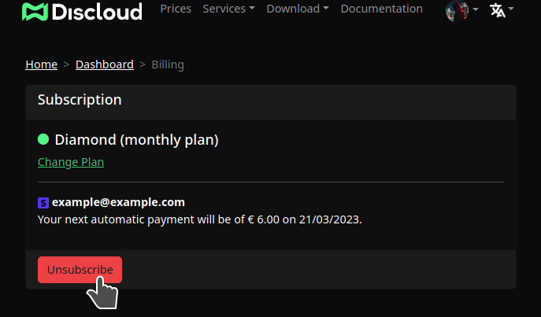
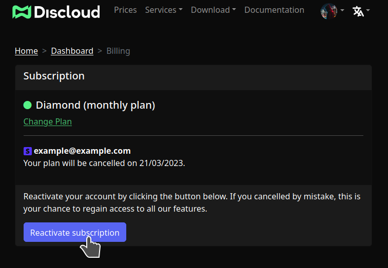

# Gerenciamento de Assinaturas

## 🧾 Visão Geral

Esta página cobre como gerenciar uma assinatura paga existente adquirida através do site da Discloud (Stripe). Se você precisar comprar um plano, veja: [Planos e Suporte](../../about/donations.md).

---

## 🔐 Acesse o Painel de Cobrança



Visite: [https://discloud.com/dashboard/billing](https://discloud.com/dashboard/billing) (faça login se solicitado).



Localize o cartão de assinatura ativa com detalhes do plano e data de renovação.



<figure><figcaption></figcaption></figure>

---

## 🔄 Cancelar Assinatura

Cancelar para futuras renovações automáticas. Os benefícios do seu plano atual permanecem até o fim do período pago.

| Efeito    | Detalhe                                         |
| --------- | ----------------------------------------------- |
| Recursos  | Permanecem ativos até a expiração               |
| Renovação | Desabilitada após cancelamento                  |
| Reversão  | Você pode reativar antes ou depois da expiração |


Cancelar antecipadamente não aciona um reembolso parcial (a menos que leis locais de consumidor exijam o contrário).


---

## ✅ Reativar Assinatura

Se você cancelou por engano (ou deseja continuar os benefícios), use Reativar. A renovação retoma no ritmo original.

<figure><figcaption></figcaption></figure>

| Cenário                     | Resultado                                                  |
| --------------------------- | ---------------------------------------------------------- |
| Reativar antes da expiração | Acesso contínuo, sem interrupção                           |
| Reativar após a expiração   | Benefícios do plano retomam assim que o pagamento processa |

---

## ❓ Perguntas Comuns

| Pergunta                                 | Resposta                                                                                                                              |
| ---------------------------------------- | ------------------------------------------------------------------------------------------------------------------------------------- |
| Cancelar remove meus apps imediatamente? | Não, os benefícios duram até o fim do período.                                                                                        |
| Posso pausar em vez de cancelar?         | Abra um [ticket](https://discord.com/channels/@me/930852077045940224/) no nosso [servidor Discord](https://discord.discloudbot.com/). |
| Onde atualizo o método de pagamento?     | Painel de cobrança / fluxo do portal Stripe.                                                                                          |
