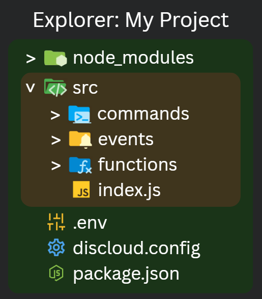

# O que é a raiz do projeto?

## 🧾 Visão Geral

A raiz do projeto ("diretório raiz") é a **pasta de nível superior da sua aplicação,** o lugar que você comprime e envia para a Discloud. Ela contém o arquivo de configuração ([`discloud.config`](../../configuracoes/discloud.config/)), manifesto de dependências (ex. [`package.json`](../../ambiente-de-desenvolvimento/linguagens-suportadas/javascript/package.json.md), [`requirements.txt`](../../ambiente-de-desenvolvimento/linguagens-suportadas/python/requirements.txt.md), [`Cargo.toml`](../../ambiente-de-desenvolvimento/linguagens-suportadas/rust/cargo.toml.md), [`Gemfile`](../../ambiente-de-desenvolvimento/linguagens-suportadas/ruby/gemfile.md)), opcional [`.env`](em-andamento-arquivo-.env.md), e as pastas com seu código fonte (ex. `src/`).

Se a estrutura estiver errada (por exemplo, você zipa uma pasta que contém outra pasta única que realmente contém os arquivos), a Discloud pode falhar em detectar o arquivo principal ou dependências.

***

## 🖼️ Exemplo Visual

A zona verde representa a **raiz** que você deve comprimir. Amarelo mostra uma pasta aninhada contendo arquivos de código. Tudo dentro do verde é incluído quando você zipa esse diretório.

<figure><figcaption></figcaption></figure>

***

### 🚫 Erros Comuns

| Erro                                   | Resultado                                     | Correção                                                                                    |
| -------------------------------------- | --------------------------------------------- | ------------------------------------------------------------------------------------------- |
| Zipping pai da raiz real               | Configuração / arquivo principal ausente      | Zipe a pasta contendo [`discloud.config`](../../configuracoes/discloud.config/) diretamente |
| Incluindo `node_modules`               | Upload grande, possíveis problemas de tamanho | Remova; deixe a plataforma instalar                                                         |
| Codificando segredos no código         | Exposição de segurança                        | Use [`.env`](em-andamento-arquivo-.env.md) e variáveis de ambiente                          |
| Múltiplos arquivos de entrada ambíguos | Falha na inicialização                        | Defina `main` em [`discloud.config`](../../configuracoes/discloud.config/) explicitamente   |
| Padrões `src/src` aninhados            | Confusão ao localizar entrada                 | Achate a estrutura                                                                          |
