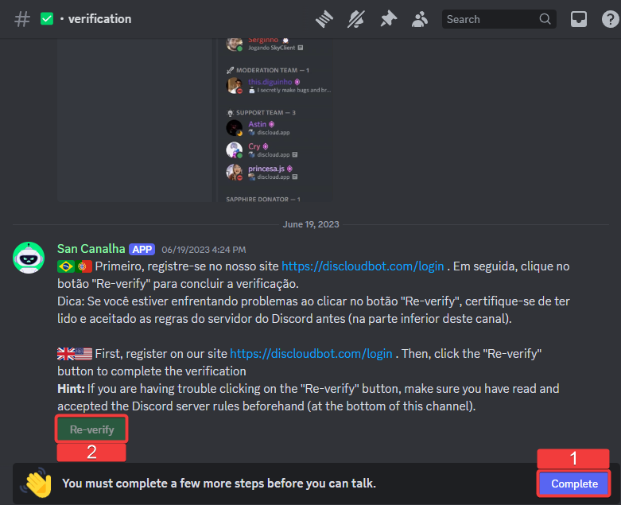

# Discord Bot

Discloud allows you to **host applications directly from Discord**, making deployment fast and accessible without needing to use a dashboard or command-line tools.

***

## 🔑 Account Verification

Before deploying applications using the **Discloud Bot**, you must first **verify your account** on the Discloud Discord server.

### **🤔 How to Verify Your Account:**



Join the [**Discloud Discord Server**](https://discord.discloudbot.com/).



Follow the instructions in the verification channel.

<figure><figcaption></figcaption></figure>



Once verified, you will be assigned the **`Verified en-us`** role.




After verification, you will gain access to the [**`#🔌・commands`**](https://discord.com/channels/584490943034425391/1051126795883261962) channel, where you can manage your applications.


***

## 🚀 Hosting Your Application

There are **two ways** to deploy an application using the Discloud Bot:

<table><thead><tr><th width="212">Method</th><th>Best For</th><th>How It Works</th></tr></thead><tbody><tr><td><a href="discord-bot.md#advanced-setup"><strong>⚙️ Advanced Setup</strong></a></td><td>Users who want a <strong>one-command</strong> deployment with pre-configured settings.</td><td>Configure everything in the <a href="../configurations/discloud.config/"><code>discloud.config</code></a> file and use <code>.upconfig</code>.</td></tr><tr><td><a href="discord-bot.md#quick-setup-step-by-step-guide"><strong>⚡ Quick Setup (legacy)</strong></a></td><td>Users who <strong>prefer a guided setup</strong> via the bot’s prompts.</td><td>The bot will ask for the necessary details after running <code>.up</code>.</td></tr></tbody></table>


**Important Notes:**

* If your [**main file**](../faq/general-questions/wip-what-is-the-main-file.md) **is not in the** [**root directory**](../faq/general-questions/what-is-the-root-of-the-project.md), you **must** use Advanced Setup or move it to the root.
* If you are hosting a **bot without an ID** (e.g., WhatsApp or Telegram), use Advanced Setup and Discloud will generate the ID automatically.






Create the [`discloud.config`](../configurations/discloud.config/) file.



Compress your project into a [`.zip`](../faq/general-questions/wip-how-to-compress.md) file.



Upload your project.

* Go to [**`#🔌・commands`**](https://discord.com/channels/584490943034425391/1051126795883261962) on the **Discloud Discord Server**.
*   Run the following command:

    ```
    .upconfig
    ```
* Send your [**.zip**](../faq/general-questions/wip-how-to-compress.md) file when prompted.



Your application will be deployed automatically.









Prepare your project.

* Ensure your application files are correctly structured.
* Compress your project into a [`.zip`](../faq/general-questions/wip-how-to-compress.md) file.



Upload your project.

* Go to [**`#🔌・commands`**](https://discord.com/channels/584490943034425391/1051126795883261962) on the **Discloud Discord Server**.
*   Run the following command:

    ```
    .up
    ```



**Provide the Required Information.**

* **Enter the** [**Application ID**](../faq/general-questions/wip-how-can-i-get-my-bots-id.md) (for Discord bots).
* **Enter the** [**Main File Name**](../faq/general-questions/wip-what-is-the-main-file.md) (e.g., `index.js`, `main.py`, `main.go`).
*   **Specify the RAM** for your bot (e.g., `100` for 100MB).

    
    When specifying the amount of RAM, you do not need to include units like "MB". Simply enter the numeric value, for example, "100" for 100MB.

    ```
               BOTs require a minimum of 100MB of RAM.
    ```
    



Send your [`.zip`](../faq/general-questions/wip-how-to-compress.md) file when prompted.







Prepare your project.

* Ensure your application files are correctly structured.
* Compress your project into a [`.zip`](../faq/general-questions/wip-how-to-compress.md) file.



Upload your project.

* Go to [**`#🔌・commands`**](https://discord.com/channels/584490943034425391/1051126795883261962) on the **Discloud Discord Server**.
*   Run the following command:

    ```
    .upsite
    ```



**Provide the Required Information.**

* **Choose a** [**Subdomain**](../faq/general-questions/wip-how-to-create-a-subdomain.md).
* **Enter the** [**Main File Name**](../faq/general-questions/wip-what-is-the-main-file.md) (e.g., `index.html`, `index.php`).
*   **Specify the RAM** for your bot (e.g., `512` for 512MB).

    
    When specifying the amount of RAM, you do not need to include units like "MB". Simply enter the numeric value, for example, "512" for 512MB.

    ```
               Websites require a minimum of 512MB of RAM.
    ```
    



Send your [`.zip`](../faq/general-questions/wip-how-to-compress.md) file when prompted.







***

## **❓ Still need help?**

Check the [**FAQ Section**](broken-reference) or join our [**Discord Server**](https://discord.discloudbot.com/) for support.
