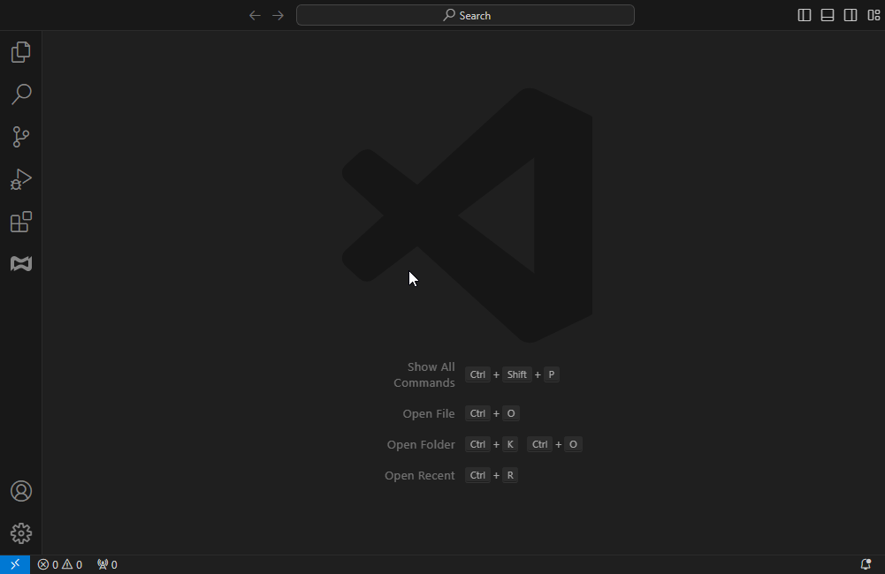
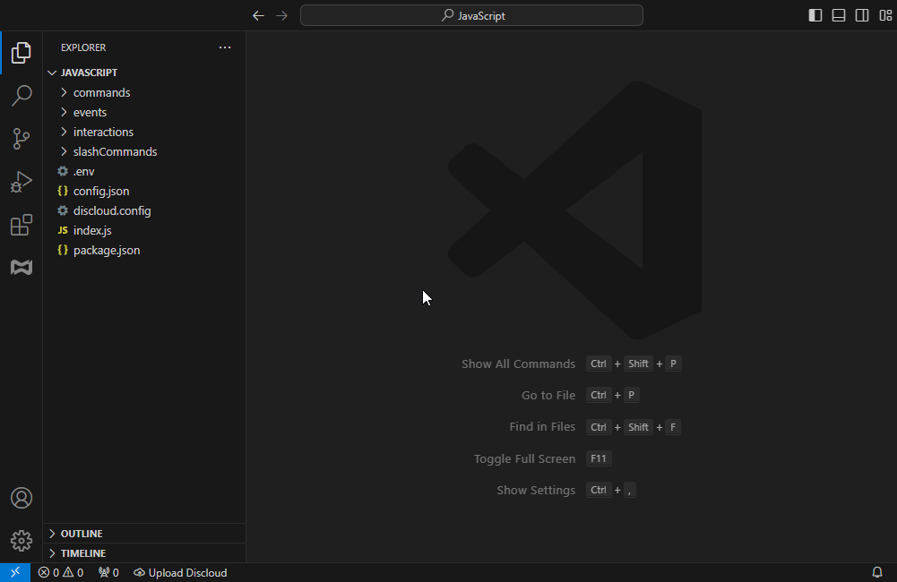

# Visual Studio Code

A [**Extensão Discloud para VSCode**](https://marketplace.visualstudio.com/items?itemName=discloud.discloud) permite que você **hospede e gerencie suas aplicações** diretamente do [**Visual Studio Code**](https://code.visualstudio.com/), eliminando a necessidade de usar um painel web ou comandos do bot Discord.

***

## 🛠️ Instalando a Extensão Discloud



Abra o VSCode no seu computador.



Vá para a aba Extensões (`Ctrl + Shift + X`).

* Na barra de pesquisa, digite: **"Discloud"** e clique em **"Instalar"**.



***

## 🔑 Fazendo Login na Discloud

Antes de fazer o upload, você precisa fazer login na sua **conta Discloud**.



Clique na **aba da Extensão Discloud** na **barra lateral do VSCode**.



Clique em **"Enviar seu token Discloud"** e insira seu [**Token da API Discloud**](../faq/general-questions/how-can-i-get-my-discloud-api-token.md).

<figure><figcaption></figcaption></figure>



Após o login, suas **aplicações Discloud** aparecerão dentro da aba da extensão.



***

## 🚀 Fazendo Upload da Sua Aplicação

Com a **Extensão VSCode**, você pode fazer o upload do seu app em apenas alguns cliques!



Preparando seu projeto.

* Certifique-se de que seu projeto contenha todos os arquivos necessários:
  * [**`discloud.config`**](https://github.com/discloud/docs/blob/portuguese-revamp/configuracoes/discloud.config) (arquivo de configuração).
  * **Dependências** necessárias para sua linguagem de programação (ex.: `package.json` para Node.js, `requirements.txt` para Python).
* **Verifique o** [**Guia de Linguagens**](../development-environment/supported-languages/) para garantir que seu projeto esteja estruturado corretamente.



Fazendo upload da sua aplicação.

<figure><figcaption></figcaption></figure>



***

## 📌 Dicas e Truques

### 📂 **Usando `.discloudignore` para Excluir Arquivos**

Se você quiser **excluir certos arquivos ou diretórios** do upload, pode criar um arquivo [`.discloudignore`](../configurations/.discloudignore.md) na raiz do seu projeto.

***

## **❓ Ainda precisa de ajuda?**

Verifique a [**Seção FAQ**](broken-reference) ou junte-se ao nosso [**Servidor Discord**](https://discord.discloudbot.com/) para suporte.
