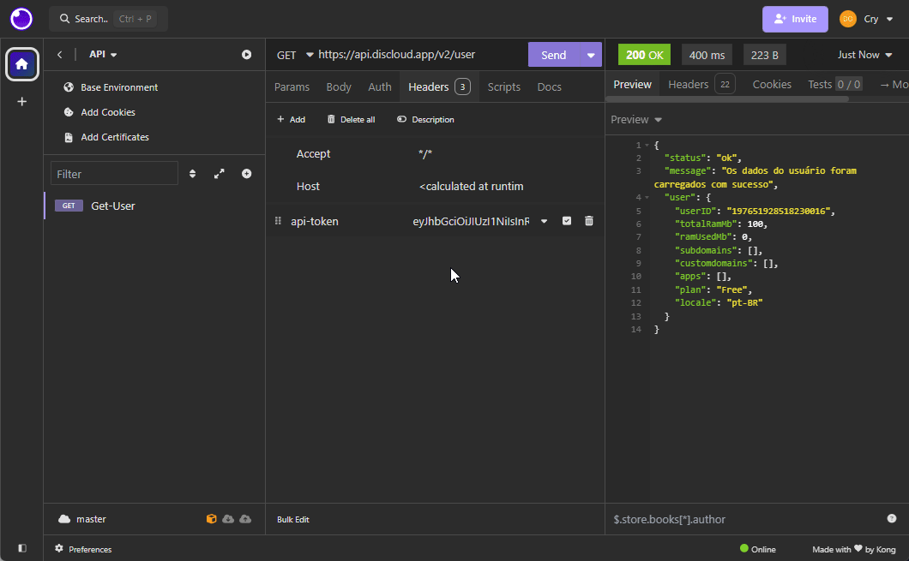
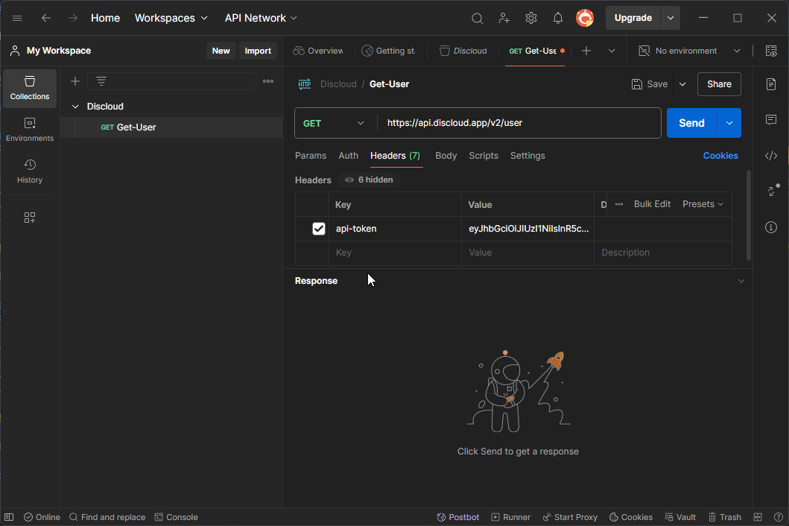

# 🔑 APIs e Automação

## 🔑 Como Recuperar o Token de Acesso à API

Para recuperar o token de acesso à API da Discloud, você pode seguir dois métodos:



Acesse [discloud.com](https://discloud.com), faça login em sua conta, e acesse a aba **API Token**, onde você pode gerar o token.

<figure><figcaption>
Aba API Token na dashboard da Discloud, onde o usuário pode gerar um novo token de API.
</figcaption></figure>



Acesse o canal de [`#🔌・commands`](https://discord.com/channels/584490943034425391/1051126795883261962) no nosso servidor Discord e digite `.api`.




**Atenção**\
\
Se você já possui um token de API e usar o comando no bot Discord novamente, o token será resetado. No site, há também a opção de resetar o token caso necessário.


***

## 🌐 Rotas da API da Discloud

Você pode acessar todas as rotas disponíveis na API da Discloud e testar diretamente na nossa página dedicada. Clique no link abaixo para mais detalhes:


Ver todas as rotas da API


***

## ⚙️ Usando Insomnia ou Postman

Além de utilizar a página de rotas, você também pode configurar e testar suas requisições à API da Discloud em ferramentas como [**Insomnia**](https://insomnia.rest/) ou [**Postman**](https://www.postman.com/). Ambas permitem gerar o código para a linguagem desejada.



Para configurar o **Insomnia**:

* Abra o Insomnia e crie uma nova requisição.
* Insira a [URL](https://api.discloud.app/v2) da API e escolha o método HTTP (GET, POST, etc.).
* Insira seu token de API no cabeçalho como `api-token` e o valor do token.
* Execute a requisição e veja o resultado, como no exemplo abaixo.

<figure><figcaption>
Exemplo de requisição no Insomnia
</figcaption></figure>



Para configurar o **Postman**:

* Abra o Postman e crie uma nova requisição.
* Insira a [URL](https://api.discloud.app/v2) da API e escolha o método HTTP (GET, POST, etc.).
* Insira seu token de API no cabeçalho como `api-token` e o valor do token.
* Execute a requisição e veja o resultado, como no exemplo abaixo.

<figure><figcaption>
Exemplo de requisição no Postman
</figcaption></figure>


