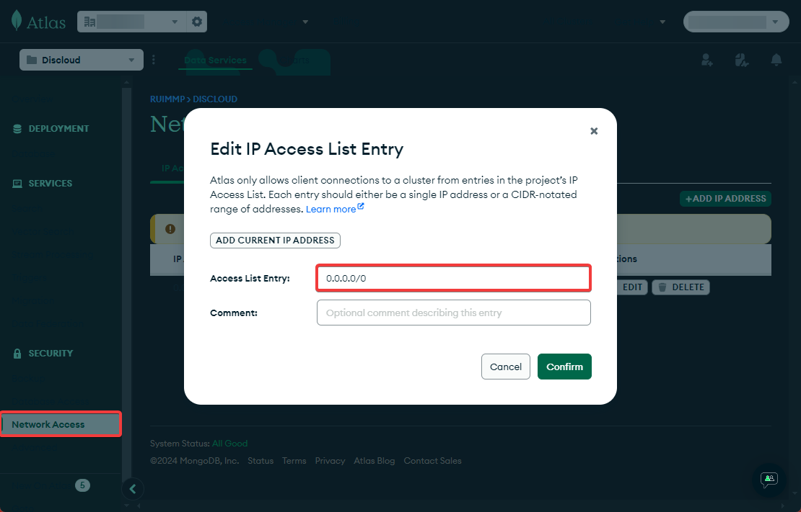

# MongoDB Atlas

## ‍💻 O que é MongoDB Atlas?

**MongoDB Atlas** é um serviço de banco de dados gerenciado que oferece infraestrutura e automação para escalar e gerenciar clusters MongoDB na nuvem. Sua facilidade de uso o torna uma opção popular para hospedar bancos de dados para bots e aplicações web.

***

## 🌍 Conectando-se ao MongoDB Atlas na Discloud

Ao hospedar a sua aplicação na **Discloud** e tentar conectá-lo ao seu banco MongoDB, você pode se deparar com um erro semelhante ao seguinte:

```vbnet
Erro ao Conectar na MeuDB: MongoNetworkError: connection 0 to meudb-shard-00-00-9m7sg.mongodb.net:27017 closed
```

Esse erro acontece porque o **MongoDB Atlas** requer que você configure os IPs permitidos para se conectar ao cluster. Como a Discloud não possui IP fixo, você precisará ajustar a configuração no painel do Atlas.

***

## 🛠️ Solucionando o Erro de Conexão

No painel do **MongoDB Atlas**, siga os passos para adicionar IPs à lista de permissões:



Acesse o **MongoDB Atlas** e navegue até seu cluster.



Clique em **"Network Access"** no menu à esquerda.



Adicione o IP **0.0.0.0/0** para permitir o acesso de qualquer origem.



<figure><figcaption></figcaption></figure>

***

## 🔗 Mais Informações

Para mais detalhes sobre como configurar o **MongoDB Atlas** com seu bot na **Discloud**, consulte os links abaixo:


Documentação MongoDB Atlas



MongoDB Network Access

