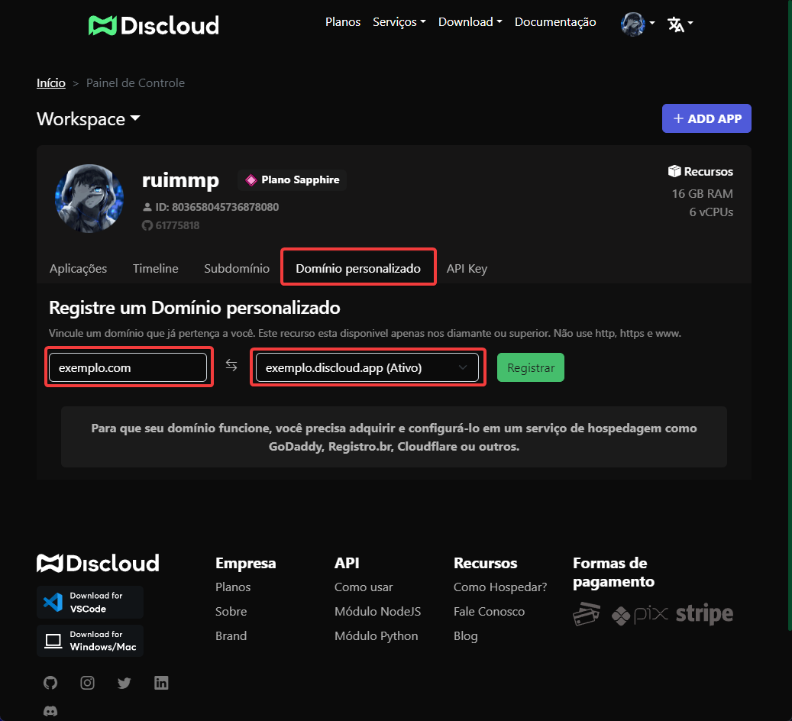
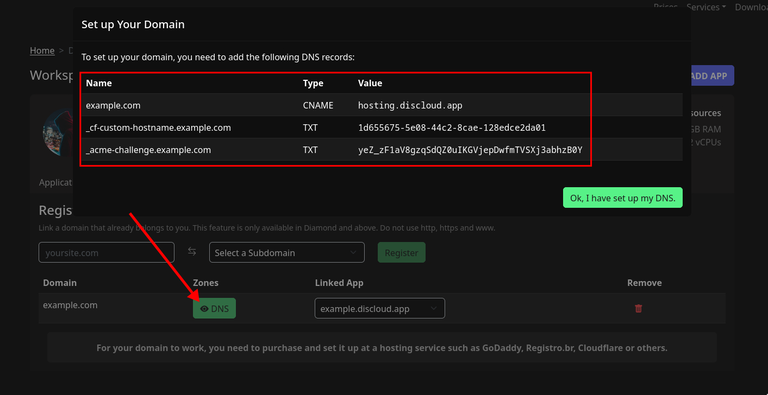
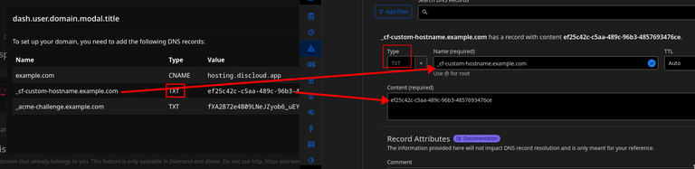
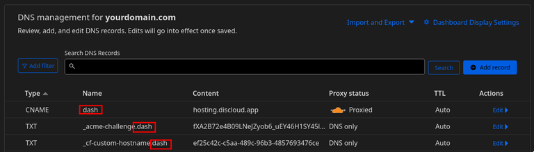
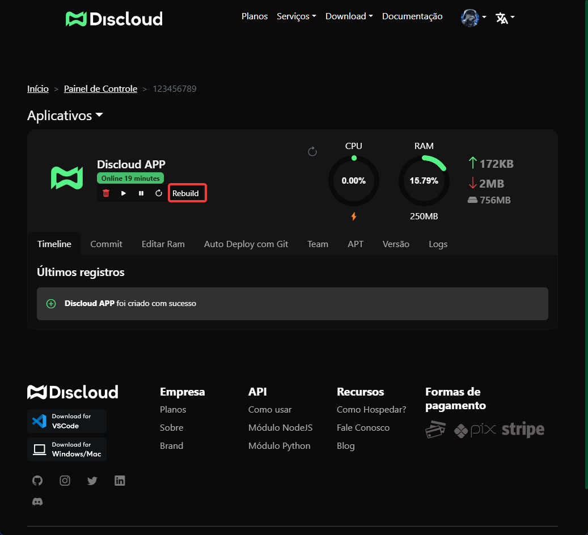

# 🌐 Domínio Personalizado

## 🌐 Seu Próprio Domínio na Discloud

Ao utilizar a **Discloud**, é possível configurar um domínio personalizado para seus aplicativos hospedados. Isso permite que você tenha um endereço próprio, como **meudominio.com**, em vez de um subdomínio padrão da Discloud.

<figure><figcaption>
Como o domínio funciona na Discloud
</figcaption></figure>

***

## 📋 Requisitos para Usar um Domínio Personalizado

Para configurar o seu domínio personalizado na Discloud, você precisará:

<table data-view="cards"><thead><tr><th align="center"></th><th></th></tr></thead><tbody><tr><td align="center"><strong>Plano Platinum ou Superior</strong></td><td>Necessário para habilitar o subdomínio. Confira nossos <a href="https://discloud.com/plans">planos</a>.</td></tr><tr><td align="center"><strong>App com Subdomínio</strong></td><td>O app já deve utilizar um subdomínio <strong>.discloud.app</strong> para vinculação com o seu domínio.</td></tr><tr><td align="center"><strong>Domínio Próprio</strong></td><td>Já deve possuir um domínio registrado. Sugerimos <a href="https://www.cloudflare.com/products/registrar/">Cloudflare</a>, <a href="https://www.godaddy.com/">GoDaddy</a>, <a href="https://registro.br/">Registro.br</a>, ou <a href="https://www.namecheap.com/">Namecheap</a>.</td></tr></tbody></table>

***

## 🌍 Como Adicionar Seu Domínio



**Acesse a** [**Dashboard da Discloud**](https://discloud.com/dashboard) **e selecione Domínio Personalizado.**



**Insira o seu domínio e escolha o subdomínio desejado. Depois, clique em Registrar.**




***

## ✅ Verificando Seu Domínio

Após registrar o domínio, você precisa provar à Discloud que é o proprietário do domínio, adicionando **registros TXT** no DNS do seu domínio, fornecidos pela Discloud.


**Configuração de DNS com Cloudflare**\
\
Nesta documentação focamos na configuração com **Cloudflare** como exemplo devido a sua praticidade.&#x20;


***

### Configuração do Cloudflare



**Faça login na** [**Cloudflare**](https://dash.cloudflare.com) **e selecione o domínio desejado.**



**Vá até a guia DNS e adicione um novo registro com os seguintes valores:**

* **Type**: CNAME&#x20;
* **Name**: @ ou o seu domínio&#x20;
* **Target**: hosting.discloud.app




**Verificação TXT**

Na **Dashboard Discloud**, copie o código **TXT** fornecido e adicione-o na configuração DNS do Cloudflare.


Caso o valor TXT retorne como `null`, isso indica que a Cloudflare (CF) já realizou a validação do domínio. Nesse caso, não é necessário inserir o registro TXT novamente.





***

## 🌐 Usando Subdomínios com Seu Domínio

Se você optou por adicionar um subdomínio ao seu domínio para uso na Discloud, a Cloudflare exibirá os valores de "name" configurados com o nome do subdomínio. Por exemplo, se você criou um subdomínio chamado **dash.seudominio.com**, o resultado ficará assim:

<figure><figcaption>
Resultado esperado para subdomínio no Cloudflare
</figcaption></figure>

***

## 🔄 Reconstruindo seu App

Após verificar o domínio, selecione o app que pertence ao domínio e clique em **Rebuild** para aplicar as mudanças.

<figure><figcaption>
Reconstrução do app para aplicar o domínio
</figcaption></figure>
