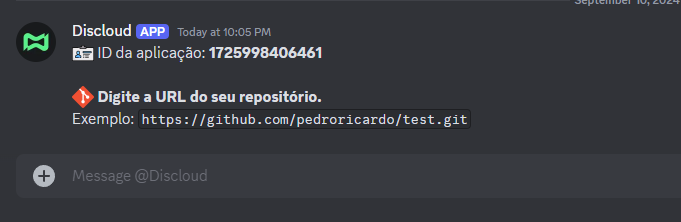
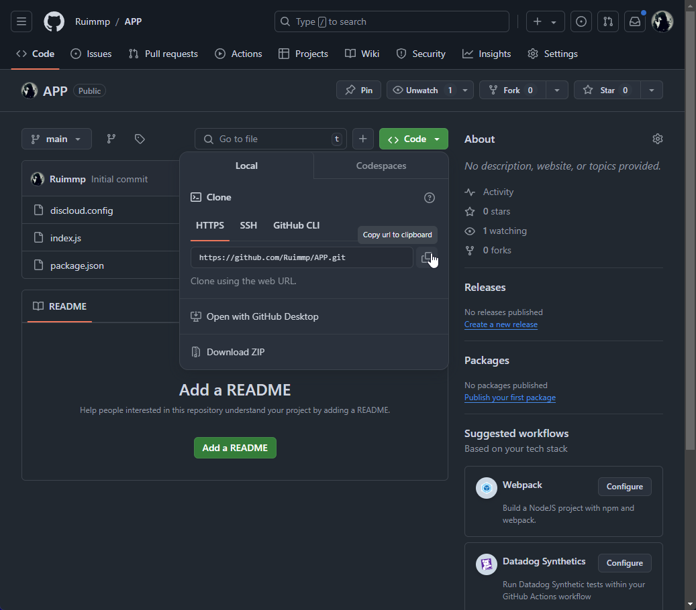
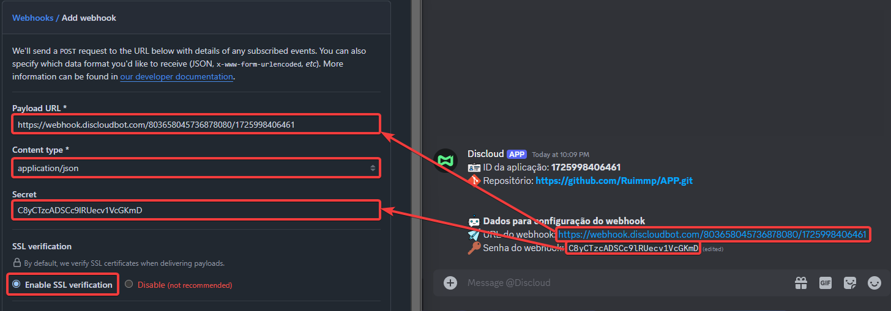
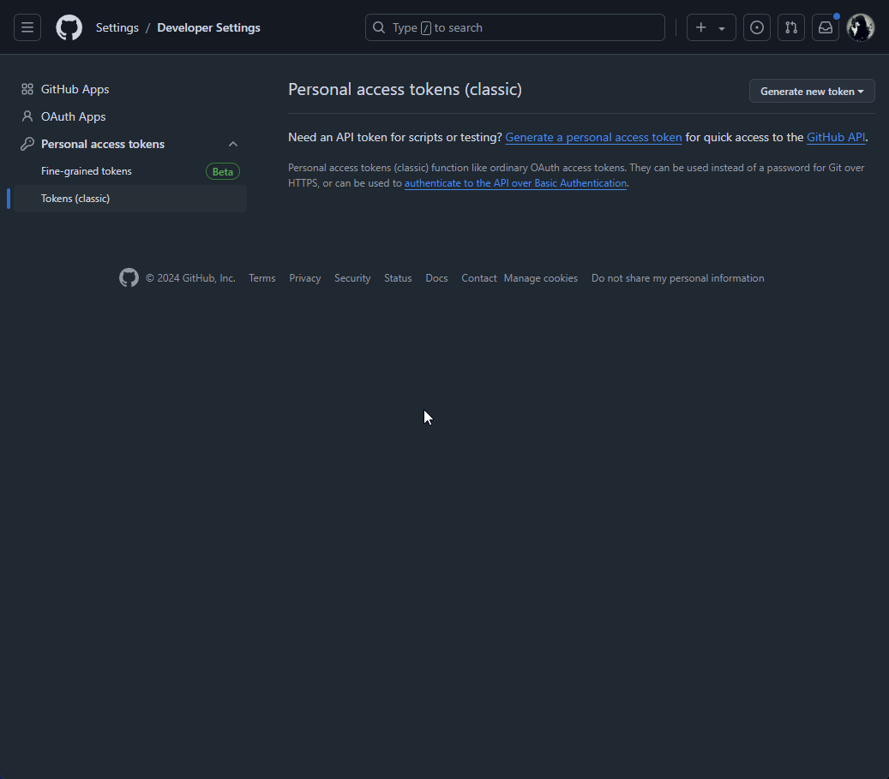

# 🐙 GitHub e GitLab

## 📝 Requisitos

Para iniciar a configuração de sincronização do seu repositório GitLab ou GitHub com a Discloud, é necessário que você tenha uma aplicação previamente configurada na plataforma e um repositório disponível no GitLab ou GitHub. Esta integração permite automatizar o processo de deploy de suas aplicações, garantindo que quaisquer atualizações no código sejam refletidas automaticamente em seu ambiente de hospedagem. Siga os passos abaixo para configurar sua sincronização e simplificar o gerenciamento contínuo de suas aplicações na nuvem.

***

## 🚀 Passos para Configuração


**Informação Importante**\
\
No momento, a configuração de sincronização só pode ser iniciada via comando `.git` no canal [**#🔌・commands**](https://discord.com/channels/584490943034425391/1051126795883261962) no Discord.






**Após usar o comando `.git`, você receberá uma mensagem privada com instruções.**




**Siga as instruções no seu privado com o bot para configurar o webhook no GitHub fornecendo o link do repositório.**




**Ao enviar o link do repositório, se acessível, você receberá os dados necessários para configurar o webhook.**


**Token de Acesso Pessoal**\
\
Caso o seu repositório seja privado ou não seja acessível, você precisará fornecer um token de acesso pessoal. Siga as instruções de como criar um token de acesso pessoal em [Configuração de Token](github-e-gitlab.md#configuracao-de-token).





**Acesse as configurações do repositório no GitHub e adicione o webhook fornecido.**







**Em Breve**\
\
A integração com o GitLab estará disponível em breve. Fique atento às atualizações.




***

## 🔐 Configuração de Token

Você precisará de um token de acesso pessoal para permitir a integração. Siga as instruções no link abaixo:


Acessar Configurações de Token


<figure><figcaption>
Configuração de Token no GitHub
</figcaption></figure>
