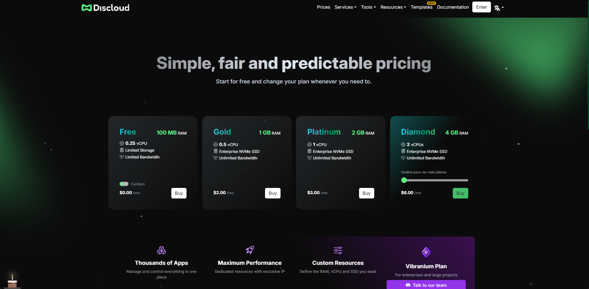

# Doações

## 🧾 Visão Geral

A Discloud oferece planos pagos que expandem limites de recursos (memória, alocação de CPU), desbloqueiam hospedagem de sites / APIs com subdomínios personalizados ou fornecidos, habilitam colaboração em equipe, integração com Git e mais. Escolher um plano também financia infraestrutura e desenvolvimento contínuo.


Se você só precisa gerenciar (cancelar / reativar) uma assinatura existente, veja: [Gerenciamento de Assinatura](../faq/general-questions/subscription-management.md)


---

## 💎 Por Que Fazer Upgrade

| Benefício                | Plano Gratuito                       | Planos Pagos                  |
| ------------------------ | ------------------------------------ | ----------------------------- |
| Espaço de Memória & CPU  | Limitado                             | Aumentado por nível           |
| Uptime persistente       | Limites de inatividade podem aplicar | Maior estabilidade            |
| Hospedagem de Site / API | Restrita                             | Habilitada (depende do plano) |
| Domínio Personalizado    | Requer plano superior                | Incluído (níveis elegíveis)   |
| Acesso à equipe          | Não disponível                       | Suportado                     |
| Integração com Git       | Limitada / nenhuma                   | Habilitada                    |

---

## 💳 Métodos de Pagamento

Dois canais de aquisição estão atualmente disponíveis.

| Método | Disponível Via                                                                                                                       |
| ------ | ------------------------------------------------------------------------------------------------------------------------------------ |
| Stripe | <ul class="contains-task-list"><li><input type="checkbox" checked>Website</li><li><input type="checkbox">Ticket de Suporte</li></ul> |
| PayPal | <ul class="contains-task-list"><li><input type="checkbox">Website</li><li><input type="checkbox" checked>Ticket de Suporte</li></ul> |


Use um ticket apenas se o fluxo de pagamento do site estiver indisponível ou seu método suportado preferido falhar.


---

## 🛒 Compra (Website)



Visite: [https://discloud.com/plans](https://discloud.com/plans)



Selecione o nível desejado e prossiga para o checkout (fluxo hospedado pelo Stripe).



Complete o pagamento. Seu plano é ativado logo após a confirmação.



<figure><figcaption>
Interface de seleção de plano.
</figcaption></figure>

---

## 🎫 Compra (Ticket de Suporte)

Use este caminho apenas para PayPal ou quando encontrar problemas de pagamento.



Abra um [ticket de suporte](https://app.gitbook.com/u/X4zpqd9m1VYNBaYRYKNE6a16KJ12) ([servidor Discord](https://app.gitbook.com/u/X4zpqd9m1VYNBaYRYKNE6a16KJ12)).



Especifique o nível do plano e o método de pagamento (ex. PayPal).



Siga as instruções fornecidas pela equipe de suporte para completar o pagamento.




Tickets são assíncronos; o tempo de resposta pode variar. Mantenha um ticket por solicitação para reduzir atrasos.


---

## 🙌 Apoiar Sem Fazer Upgrade

Se você não pode fazer upgrade, mas ainda quer ajudar:

| Método            | Descrição                                 |
| ----------------- | ----------------------------------------- |
| Feedback          | Relate bugs, sugira melhorias             |
| Documentação      | Contribua com esclarecimentos ou exemplos |
| Ajuda Comunitária | Ajude usuários no Discord                 |
