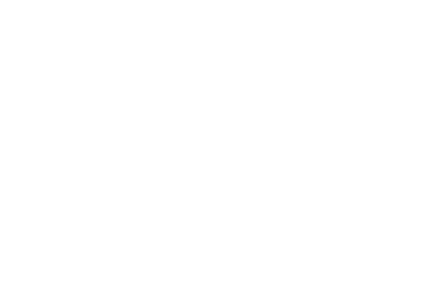
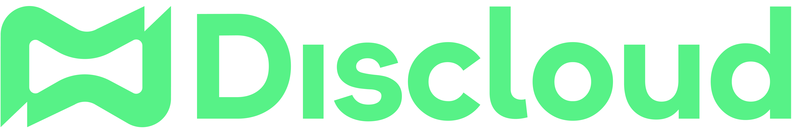
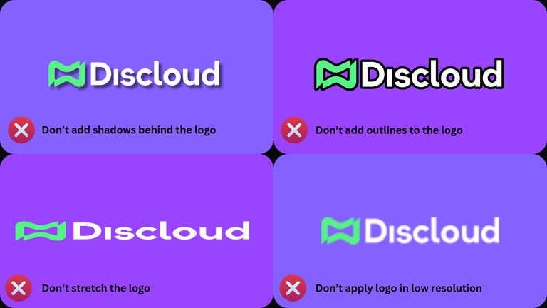

# Marca Discloud

## 🧭 Propósito

Esta página fornece uma referência concisa e única para usar o nome e ativos visuais da Discloud. Mantenha o uso claro, consistente e não enganoso. Em caso de dúvida, link para nossa plataforma em vez de modificar elementos da marca.


Não apresente a Discloud como endossando, patrocinando ou parceira do seu projeto, a menos que explicitamente acordado.


***

## 🧩 Nome & Significado

O nome combina o prefixo derivado do português / latim **dis-** (dividir, distribuir, separar) com **cloud** (como em computação em nuvem).

> Estamos dissolvendo, dividindo e compartilhando computação em nuvem entre as pessoas.

| Prefixo | Palavra | Conceito                                        |
| ------- | ------- | ----------------------------------------------- |
| dis-    | cloud   | Acesso democratizado à infraestrutura escalável |

***

## ♾️ Símbolo & Narrativa

O símbolo central é inspirado em:

* Uma fita de Möbius: evolução e iteração contínuas.
* Um recipiente abstrato com tampa: equilíbrio entre tempo e eficiência.
* Superfícies interconectadas: peças de infraestrutura formando uma plataforma perfeita.

Essas metáforas expressam flexibilidade, confiabilidade e escala acessível.

***

## 🔱 Logo Assets





<figure><figcaption></figcaption></figure>

<figure><figcaption></figcaption></figure>

<figure><figcaption></figcaption></figure>



<figure><figcaption></figcaption></figure>

<figure><figcaption></figcaption></figure>

<figure><figcaption></figcaption></figure>







<figure><figcaption></figcaption></figure>

<figure><figcaption></figcaption></figure>

<figure><figcaption></figcaption></figure>

<figure><figcaption></figcaption></figure>

<figure><figcaption></figcaption></figure>



<figure><figcaption></figcaption></figure>

<figure><figcaption></figcaption></figure>

<figure><figcaption></figcaption></figure>

<figure><figcaption></figcaption></figure>

<figure><figcaption></figcaption></figure>

<figure><figcaption></figcaption></figure>






Se uma variante de ativo que você precisa não estiver presente (ex.: contorno monocromático), contate a equipe em vez de criar uma.


***

## 🖌️ Paleta de Cores

| Função               | Nome                        | Hex       | Notas                     |
| -------------------- | --------------------------- | --------- | ------------------------- |
| Primária             | Verde Malaquita Muito Claro | `#57F287` | Accent principal          |
| Primária (Contraste) | Verde Mar Médio (tom)       | `#45BE6C` | Hover / contextos escuros |
| Accent 1             | Azul Muito Claro            | `#5865F2` | Ênfase secundária         |
| Accent 2             | Rosa Carmim                 | `#ED4245` | Erros / destrutivo        |
| Accent 3             | Milho                       | `#FEE75C` | Avisos / destaques        |
| Neutro Médio         | Prata Filipina              | `#B5B5B5` | Texto mudo / divisores    |
| Fundo Base           | Preto Vampiro               | `#0B0B0B` | Fundo principal           |
| Fundo Alt            | Preto Fumacento             | `#0F0F0F` | Painéis / seções          |
| Fundo Elevado        | Preto Assustador            | `#1B1B1B` | Cartões / sobreposições   |


Mantenha contraste suficiente para acessibilidade ao colocar texto verde sobre superfícies escuras.


***

## ✅ Usos Aceitáveis

| Cenário                        | Permitido   | Notas                               |
| ------------------------------ | ----------- | ----------------------------------- |
| Link para Discloud             | Sim         | Use logo oficial não modificado     |
| Comparação de produto (neutra) | Sim         | Deve ser factual e não depreciativo |
| Anúncio de parceria            | Condicional | Precisa de aprovação escrita prévia |
| Mercadoria para revenda        | Não         | Licença explícita necessária        |
| Substituição de ícone de app   | Não         | Não implique cliente oficial        |

***

## 🚫 Restritos / Não Faça

Não aplique transformações que diluam a clareza ou distorçam a marca.

| Mau Uso                           | Descrição                             |
| --------------------------------- | ------------------------------------- |
| Sombras projetadas                | Evite efeitos ornamentais             |
| Contornos / traços                | Não adicione bordas                   |
| Esticar / inclinar                | Preserve proporção de aspecto         |
| Baixa resolução                   | Sempre use ativos de tamanho adequado |
| Posicionamento de baixo contraste | Garanta contraste suficiente          |
| Recoloração                       | Use apenas variantes fornecidas       |

<figure><figcaption></figcaption></figure>


Se um tratamento necessário parecer fora dos ativos disponíveis, solicite-o!


***

## 🔗 Atribuição & Links

Ao referenciar a Discloud em artigos, docs ou repositórios open-source:

* Use o nome "Discloud" com D maiúsculo.
* Link para [https://discloud.com](https://discloud.com/) na primeira menção.
* Evite formas possessivas se criarem ambiguidade (prefira "plataforma Discloud" sobre variações informais).
