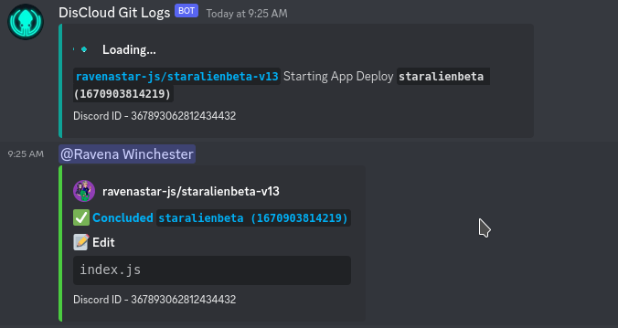
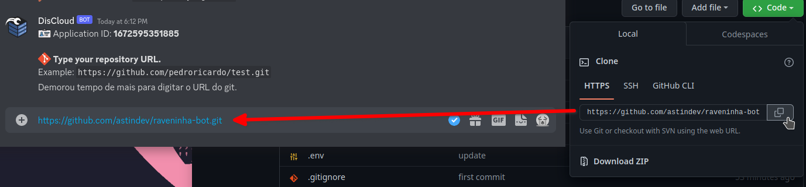
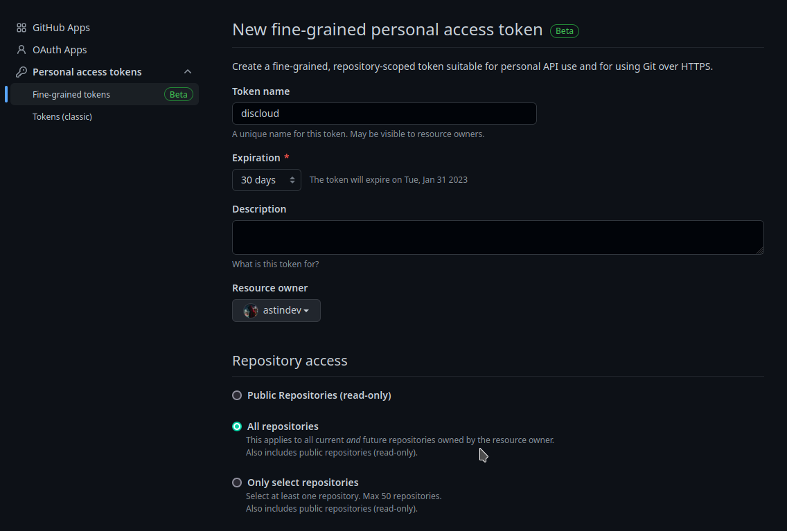
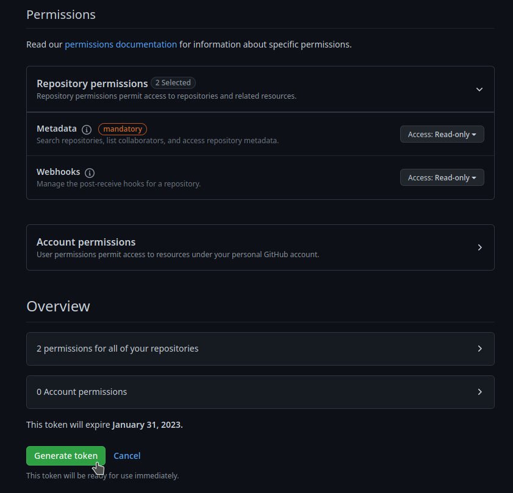
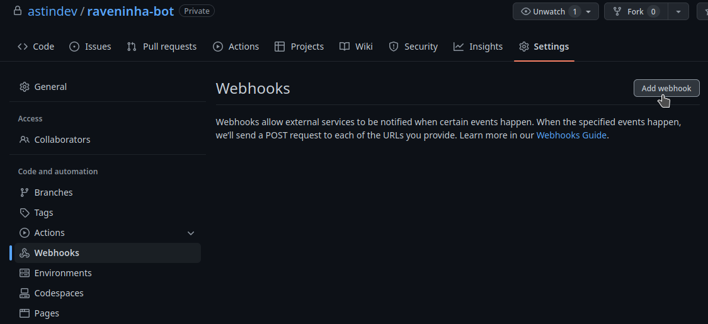
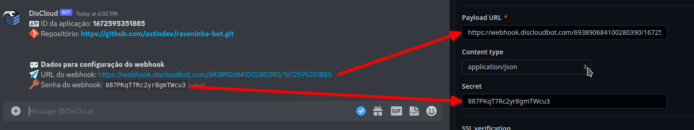

# git

Sincronize um repositório git com a sua aplicação para atualizações _(commits)_ automáticas.

Sempre que um commit for enviado para o repositório da sua aplicação, a DisCloud irá atualizar os arquivos da sua aplicação automaticamente.

<figure><figcaption>
Exemplo dos logs do git na DisCloud durante um deploy
</figcaption></figure>


Este recurso só está disponível para os planos pagos.


## :pencil: Requisitos

É necessário que a sua aplicação já esteja hospedada na DisCloud.

## **Como Usar?**

#### Entre no canal de texto `#🔌・commands` e digite `.git`

<figure><figcaption>
Comando .git no canal de comandos
</figcaption></figure>



## URL do Repositório

Entre na DM do bot da DisCloud e cole a URL do repositório para a sua aplicação.

<figure><figcaption>
Colando o URL do repositorio
</figcaption></figure>

## Configure o Token de Acesso ([Abrir Github](https://github.com/settings/personal-access-tokens/new))

É importante que o acesso esteja para todos os repositórios _(principalmente se você desejar ativar a sincronização para mais de 1 aplicação)_

<figure><figcaption></figcaption></figure>

### Configuração de Permissões

Selecione a configuração de `Webhooks` para apenas leitura e gere o seu Token.

<figure><figcaption></figcaption></figure>

## Webhook

Abra o repositório da sua aplicação e crie um `webhook`

<figure><figcaption></figcaption></figure>

### Configurando o Webhook

Certifique-se de mudar o `content type` para `application/json`

<figure><figcaption></figcaption></figure>



