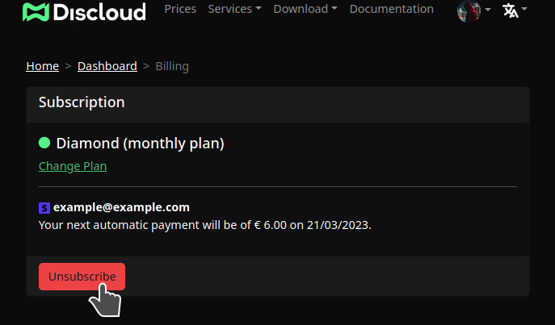
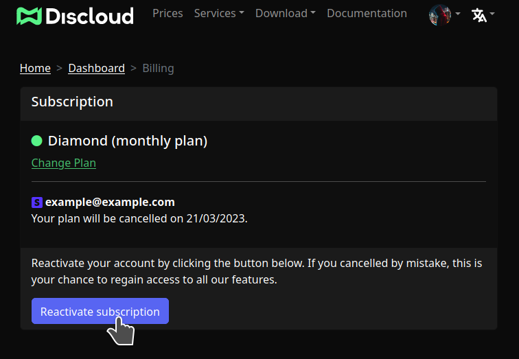

# 🤲 Doações

A **Discloud** oferece planos pagos para que você possa desfrutar de recursos extras além do plano gratuito.&#x20;

Ao adquirir um plano pago, você terá acesso a recursos exclusivos, como **mais memória**, **maior capacidade de processamento**, **hospedagem de sites com subdomínios gratuitos** (ou com o seu próprio domínio), **compartilhamento de acesso aos seus aplicativos com membros da sua equipe**, **integração com o Git** e muito mais. Além disso, ao escolher um plano pago, você estará apoiando o desenvolvimento contínuo do projeto e a ajudar-nos a manter os nossos servidores dedicados operacionais.

### :dollar: Métodos de Pagamento

Você pode adquirir um plano por meio de um método de pagamento com o **Stripe**, **PayPal**, **Mercado Pago** e **Pix**.

<table><thead><tr><th width="273.0231749710313">Método de Pagamento</th><th width="186.2796588813859" data-type="checkbox">Disponível via Site</th><th data-type="checkbox">Disponível via Ticket</th></tr></thead><tbody><tr><td>Stripe</td><td>true</td><td>false</td></tr><tr><td> PayPal</td><td>false</td><td>true</td></tr><tr><td> Mercado Pago</td><td>false</td><td>true</td></tr><tr><td> Pix</td><td>false</td><td>true</td></tr></tbody></table>

###  Comprar via Site

Acesse o site [discloudbot.com/plans](https://discloudbot.com/plans) e escolha o seu plano.

###  Comprar via Ticket

Para comprar um plano através do Ticket, basta enviar uma mensagem solicitando o método de pagamento desejado, como o PayPal, e aguardar a resposta da nossa equipe.


Se o método de pagamento desejado estiver disponível [via site](doacoes.md#via-site) utilize apenas o **Ticket** se estiver **enfrentando problemas** de pagamento ou quando site estiver **indisponível**.


Consulte abaixo para mais detalhes:


[ticket.md](faq/ticket.md)


## :arrows\_counterclockwise: Assinatura

Ao adquirir um plano pelo site da Discloud (via Stripe), será ativada uma assinatura mensal que permanecerá ativa até que o você faça o seu cancelamento.

### :red\_circle:Cancelar assinatura

Ao cancelar a assinatura, o seu plano atual não será renovado automaticamente. No entanto, é importante lembrar que você perderá o acesso aos recursos do plano assim que ele expirar. \
**Para cancelar a sua assinatura acesse:** [https://discloudbot.com/dashboard/billing](https://discloudbot.com/dashboard/billing)

<figure><figcaption>
Clique em "Unsubscribe" ou "Cancelar assinatura"
</figcaption></figure>

### :green\_circle:Reativar Assinatura

Se você cancelou por engano, esta é uma excelente oportunidade para recuperar o acesso a todos os recursos que o seu plano oferecia.\
Para reativar a sua subscrição acesse: [https://discloudbot.com/dashboard/billing](https://discloudbot.com/dashboard/billing).

<figure><figcaption>
Clique em "Reactivate subscription" ou "Reativar assinatura"
</figcaption></figure>
