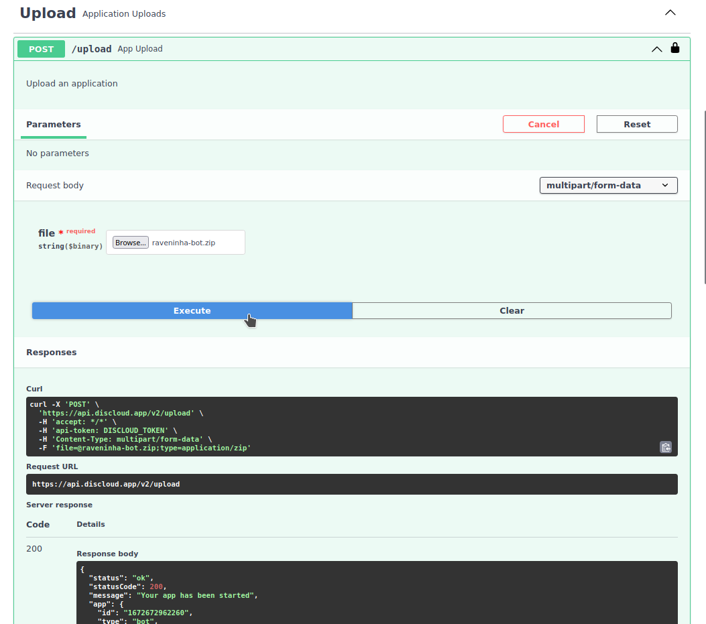

# Bot muito pesado

## :wastebasket: Dicas para diminuir o tamanho do projeto

Verifique se as seguintes **pastas** e **arquivos** se encontram no seu projeto e remova-os:

* **pasta** `node_modules` (apenas disponível em projetos [JavaScript](../linguagens/javascript/#arquivos), não é necessária e a **DisCloud** irá baixar todos os módulos necessários por conta própria)
* **pasta** `venv` e `.cache` (apenas disponível em projetos [Python](../linguagens/python/#arquivos))
* **pasta** `.git` (Não é necessário na **DisCloud**, esta pasta contém todas as informações necessárias para o controle de versão do [Git](broken-reference), pode ser necessário manter localmente se você trabalhar com [Git](broken-reference).
* **arquivos** `ffmpeg` (você pode instalar o ffmpeg na DisCloud consulte [aqui](../../discloud.config/configurar/apt.md))

## :file\_folder: O projeto continua pesado

### Métodos alternativos

#### [DisCloud API](../../api/usar-a-api.md)

Se o arquivo `.zip` do seu projeto tiver um tamanho `<=100mb` pode fazer o Upload pela nossa API

<figure><figcaption>
Exemplo pelo site das rotas da nossa Api 
</figcaption></figure>
