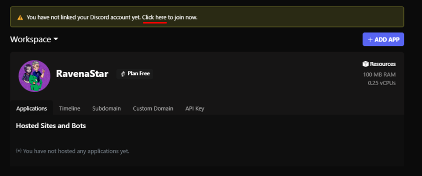
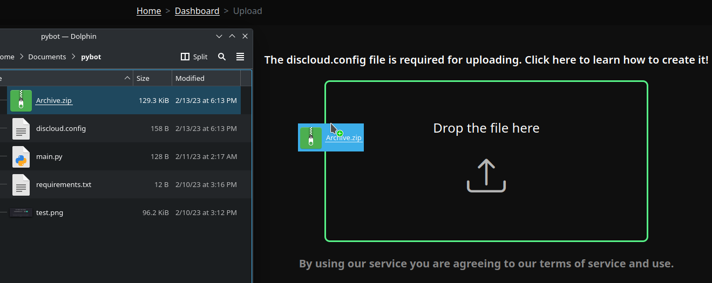
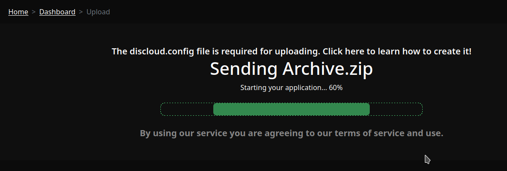

# ☁ Como Hospedar

## :bust\_in\_silhouette:Registro

Para realizar o seu registro na [**Discloud**](https://discloudbot.com/login), faça o ‘login’ através da sua conta [Github](https://github.com/).

<figure><figcaption></figcaption></figure>

## Integrar com uma conta Discord (opcional)


Não é possível criar **novos registros** usando uma conta Discord. No entanto, você pode integrá-la a uma conta Github para importar seu plano atual e aplicativos existentes.


Para importar o seu **plano atual** e **aplicativos** já hospedados, siga as instruções abaixo.

<figure><figcaption>
Clique no aviso em amarelo para integrar a sua conta Discord
</figcaption></figure>

## :cloud:Hospedar as suas apps


[linguagens](../linguagens/)


> 1. **Remova (ou não inclua no .zip) as seguintes pastas/arquivos** nos seguintes projetos:\
>    :yellow\_square:[JavaScript](../linguagens/javascript/): remova `node_modules`, `.npm` e `package-lock.json`\
>    :snake:[Python](../linguagens/python/): remova `venv` e `.cache`\
>    ``outros: `.git`
> 2. **Coloque o arquivo** [discloud.config](broken-reference) na raiz do seu projeto e não se esqueça de incluir no .zip

<figure><figcaption>
Arraste o .zip com o seu projeto
</figcaption></figure>

<figure><figcaption></figcaption></figure>
