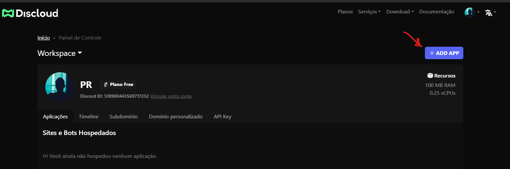

# ☁ Como Hospedar

## :bust\_in\_silhouette: Faça seu registro em nosso site

Para realizar o seu registro na [**Discloud**](https://discloudbot.com/login), clique em [entrar](https://discloudbot.com/login) e logo depois faça o ‘login’ através da sua conta [Github](https://github.com/).

<figure><figcaption></figcaption></figure>

## 2- Acesse o seu painel de controle

<figure><figcaption>
Acesse o painel de controle após o seu login no site
</figcaption></figure>

## 3- Clique no botão para hospedar sua aplicação

<figure><figcaption>
Clique no botão indicado para hospedar uma nova aplicação
</figcaption></figure>

## 4- Crie um arquivo .zip

> **Remova (ou não inclua no .zip) as seguintes pastas/arquivos** nos seguintes projetos:\
> :yellow\_square:[JavaScript](../linguagens/javascript/): remova `node_modules`, `.npm` e `package-lock.json`\
> :snake:[Python](../linguagens/python/): remova `venv` e `.cache`


[linguagens](../linguagens/)



**Coloque o arquivo** [discloud.config](../../discloud.config/configurar/#exemplo-para-bot) na raiz do seu projeto e não se esqueça de incluir no .zip\
\
Sem esse arquivo seu upload não vai funcionar!!



[configurar](../../discloud.config/configurar/)


## :cloud:Hospedar os seus Apps


Para hospedar sites consulte os [requisitos](sites/#requisitos)


<figure><figcaption>
Arraste o .zip com o seu projeto
</figcaption></figure>

<figure><figcaption></figcaption></figure>

## :link:Outros Métodos

:robot:Para Bots:

> * :electric\_plug:[via Bot](bots/bot.md)
> * :jigsaw:[via VSCode](bots/vscode.md)
> * :keyboard:[via DisCloud CLI](bots/cli.md)

:earth\_americas:Para Sites:

> * :electric\_plug:[via Bot](sites/bot.md)
> * :jigsaw:[via VSCode](sites/vscode.md)
> * :keyboard:[via DisCloud CLI](sites/cli.md)
