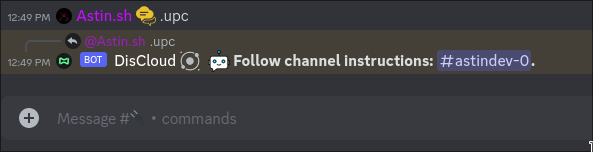

# 🔌 via Bot

## :cloud:Antes de Hospedar

Antes de hospedar recomendo consultar a documentação da linguagem utilizada pelo seu bot.


[linguagens](../../linguagens/)


### :robot:Hospedando o Seu Bot

Se você estiver com o cargo `Verified pt-br`, significa que você se registou com sucesso na **DisCloud**.&#x20;



#### 1. Digite `.upc` no canal `#🔌・commands`

<figure><figcaption></figcaption></figure>

#### 2. Crie o ficheiro discloud.config conforme o seu projeto

Copie e modifique o nosso [configurar](../../../discloud.config/configurar/ "mention") de exemplo para usar no seu app.

<figure><figcaption>
Um simples exemplo com discloud.config, mostrando o perfil do bot na dashboard
</figcaption></figure>

#### 3. Crie e carregue o arquivo .zip do seu bot. [zip.md](../../faq/zip.md "mention")

> **Remova (ou não inclua no .zip) as seguintes pastas/arquivos** nos seguintes projetos:\
> :yellow\_square:[JavaScript](../../linguagens/javascript/): remova `node_modules`, `.npm` e `package-lock.json`\
> :snake:[Python](../../linguagens/python/): remova `venv` e `.cache`

<figure><figcaption></figcaption></figure>



#### 1. Digite `.upc` no canal `#🔌・commands`

#### 2. Cole o ID do seu bot. [id-bot.md](../../faq/id-bot.md "mention")

<figure><figcaption></figcaption></figure>

#### 3. Introduza o nome ou o caminho do seu arquivo principal. [arquivo-principal.md](../../faq/arquivo-principal.md "mention")

<figure><figcaption></figcaption></figure>

#### 4. Introduza a quantidade de RAM (em MB) para o seu app.

<figure><figcaption></figcaption></figure>

#### 5. Crie e carregue o arquivo .zip do seu bot. [zip.md](../../faq/zip.md "mention")&#x20;

<figure><figcaption></figcaption></figure>




Você pode acessar os comandos usando o comando `.help` ou `.help <comando>` para saber como usar o comando mencionado.

