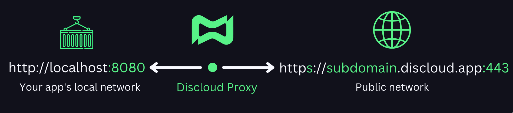
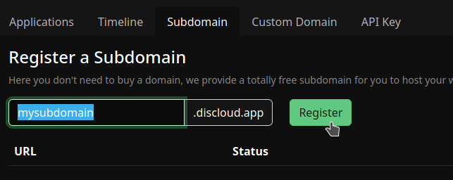

# 🌎 Sites

Na **Discloud**, qualquer app que utilize uma **porta** e necessite de **acesso externo** por meio desta para ser acessado é considerado um site. Isto inclui bots com dashboards, dashboards, APIs, sites estáticos e dinâmicos, e muitos outros...

<figure><figcaption>
Como funciona o subdominio na Discloud
</figcaption></figure>

Para permitir o acesso externo ao seu app, a **Discloud** oferece a opção de criar um **subdomínio** personalizado. Este **subdomínio** redireciona o tráfego através de um proxy para a porta **8080** do seu app, permitindo assim que você e os usuários acessem o seu site de forma segura e confiável.

## :pencil:Requisitos

#### Para começar a hospedar o seu site na **DisCloud,** você precisa dos seguintes requisitos listados abaixo:

> * Necessita de um [**Plano Platina** ](https://discloudbot.com/plans)**ou superior**.
> * Necessita de registrar um **subdomínio**. (Pode fazê-lo pelo nosso Bot com o comando **`.sd`**, ou pela `dashboard`)
>
> 
>
> * Você deve utilizar a porta **`8080`** na sua aplicação.
> * Coloque o seu **subdominio** no arquivo [**discloud.config**](../../../discloud.config/configurar/#exemplo-para-site)**.** \
>   Para inserir o seu subdomínio, basta colocar o seu subdomínio na linha `ID=subdomínio`, substituindo "`subdomínio`" **apenas com nome do seu subdomínio** ~~_(não digite a parte .discloud.app, não é necessário)._~~

## Use o seu próprio domínio

Você tem um plano [**Diamond ou superior**](https://discloudbot.com/plans)? Saiba como usar o seu próprio **domínio.com** na **Discloud**!


[seu-proprio-dominio.md](../../integracao/seu-proprio-dominio.md)

