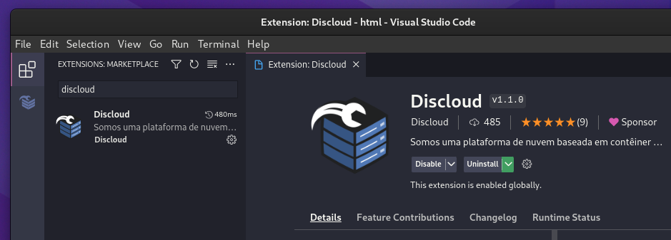
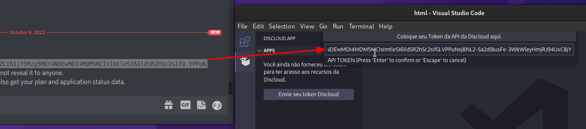
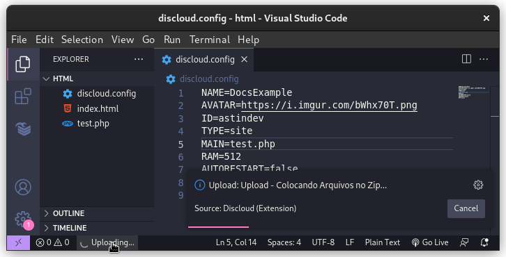

# 🧩 via VSCode

## :pencil:Requisitos

#### 1. Você precisa de usar o comando [**api**](../../comandos/api.md)**, para obter o seu token da API da DisCloud**.

<figure><figcaption>
Usando o comando .api
</figcaption></figure>

#### 2. Configure o seu `discloud.config`


[configurar](../../../discloud.config/configurar/)


## :jigsaw:Instalando a Extensão

&#x20;     [`VSCode Marketplace`](https://marketplace.visualstudio.com/items?itemName=discloud.discloud)        |        [`Open VSX Registry`](https://open-vsx.org/extension/Discloud/discloud)  \
&#x20;                    VSCode                              VSCodium, Code OSS

<figure><figcaption></figcaption></figure>

### :gear:Configurando a Extensão

#### Coloque o seu Token da `API da DisCloud`

<figure><figcaption></figcaption></figure>

### :cloud:Hospedando com a Extensão


Certifique-se de ter o arquivo [discloud.config](../../../discloud.config/configurar/#exemplo-para-site), antes de prosseguir


<figure><figcaption></figcaption></figure>
