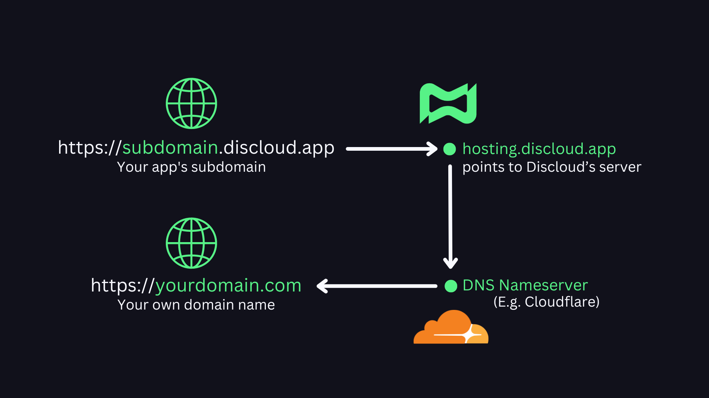
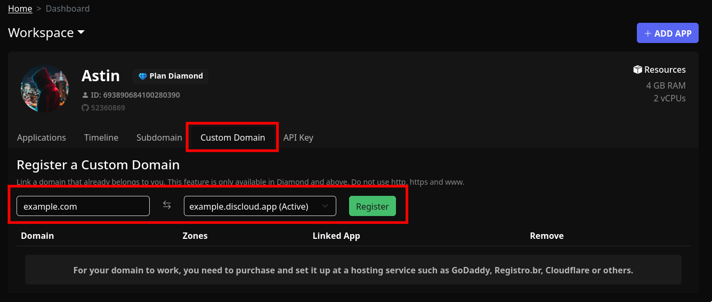
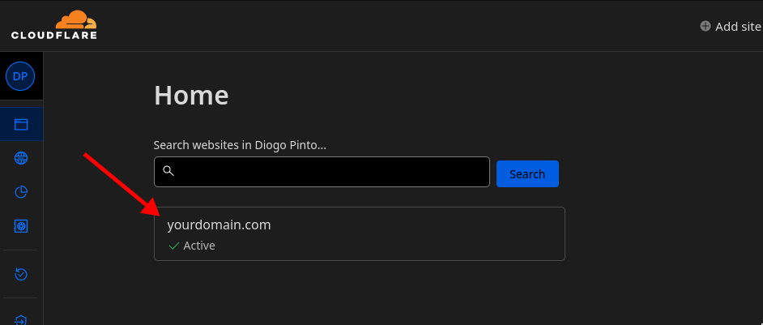
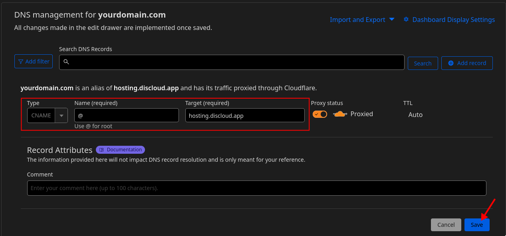
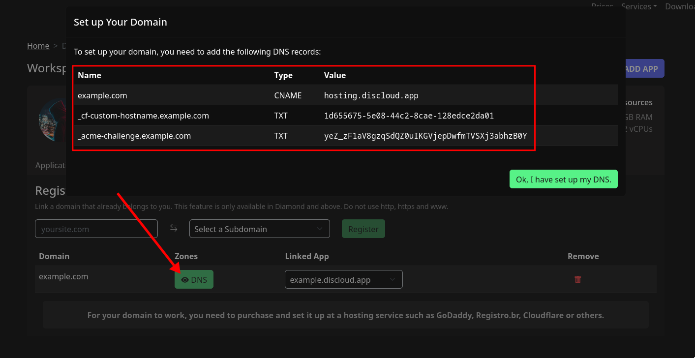
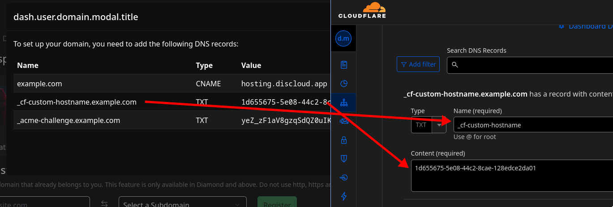
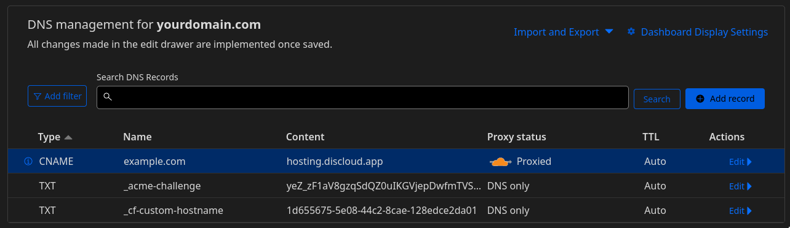
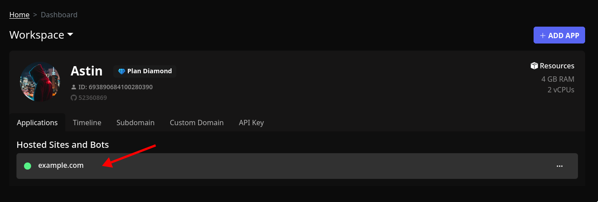
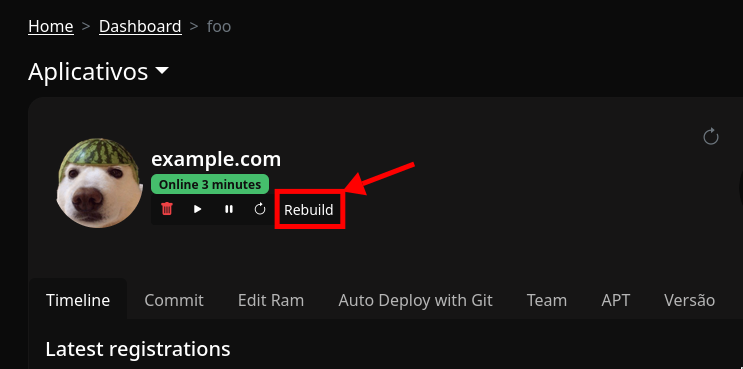

# 🌐 Seu próprio domínio

<figure><figcaption>
Como o domínio funciona na Discloud
</figcaption></figure>

## :pencil:Requisitos

Para começar a utilizar o seu domínio na **Discloud**, tem de cumprir os seguintes requisitos:

1. É necessário um [Plano Diamante](https://discloudbot.com/plans) **ou superior**.
2. É necessário ter uma aplicação que utilize um **subdomínio**, é necessário para estabelecer uma ligação ao seu **nome de domínio**.
3. Além disso, já deve ter um **nome de domínio** :)

## :globe\_with\_meridians:Adicionar o seu domínio 

1. Em seu navegador, faça login na [Dashboard da DIscloud](https://discloudbot.com/dashboard) e selecione **Custom Domain**
2. Digite seu **nome de domínio**, selecione o **subdomínio** desejado, e clique em <mark style="background-color:green;">Registrar</mark>

<figure><figcaption></figcaption></figure>

## :white\_check\_mark:Verifique o seu domínio

A primeira coisa que tem de fazer depois de adicionar um nome de domínio personalizado é mostrar à **Discloud** que você controla este domínio.

Isso pode ser feito adicionando registros TXT com um código exclusivo gerado pela **Discloud**, aos registros de DNS do seu domínio (no portal de gerenciamento de domínios do seu registrador)


Nestas docs, focamos apenas na configuração com a **Cloudflare**.


### Cloudflare 

Faça login na sua [conta Cloudflare](https://dash.cloudflare.com) e selecione o domínio que deseja usar.

<figure><figcaption></figcaption></figure>

Selecione a guia **DNS** → **Adicionar registro**. Digite os seguintes valores:

> * **Type**: CNAME
> * **Name**: @ (Se o valor @ não for aceite, digite seu domínio em vez disso)
> * **Target**: hosting.discloud.app

<figure><figcaption>
Exemplo com os valores adicionados
</figcaption></figure>

Vá para a janela de **Configuração de domínio** na Discloud. Cole o texto que você copiou de **Name** / **Value** e cole-o num registro na **Cloudflare**, faça o mesmo com as **2 linhas TXT**.

<figure><figcaption>
Janela de configuração do domínio personalizado do Discloud.
</figcaption></figure>

 

<figure><figcaption>
Como devem ser colados no registro do Cloudflare
</figcaption></figure>

#### Resultado esperado

<figure><figcaption></figcaption></figure>

## :construction\_site:Reconstrua o seu app

Selecione o app que pertence ao seu domínio e clique em **Rebuild**

<figure><figcaption></figcaption></figure>

 

<figure><figcaption></figcaption></figure>

